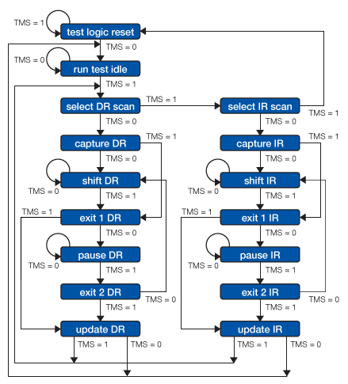
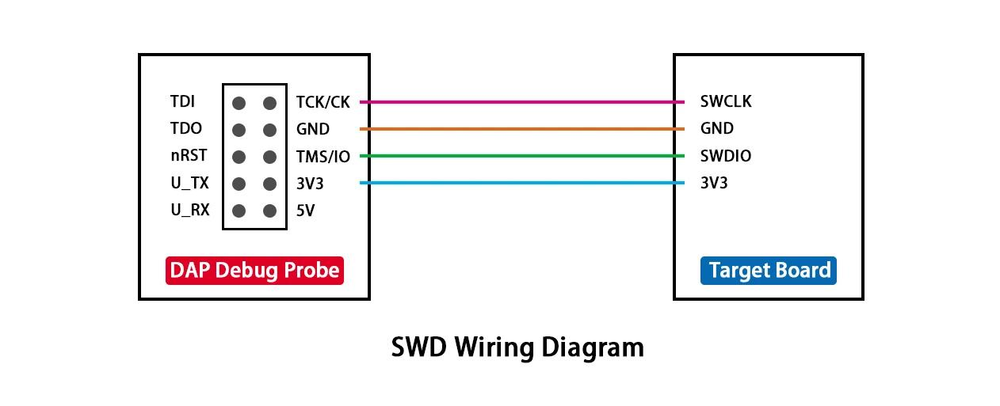

## 第 1 章：物理与链路层（信号与帧）
- ## 1.1 JTAG 接口引脚定义与电气特性
- JTAG（Joint Test Action Group，IEEE 1149.1）定义的不仅仅是一套调试协议，还规定了**标准接口引脚、电气时序以及状态机**。对于 MCU、SoC、FPGA、CPU 等芯片而言，JTAG 接口通常由 **4 根必需信号 + 1 根可选信号 + 若干辅助信号**组成。
- ### 1.1.1 JTAG 标准引脚定义
- 最常见的是 **20 Pin（ARM）、10 Pin Cortex、14 Pin TI、16 Pin MIPS** 等接口，但真正属于 IEEE1149.1 标准的只有下面几个信号。
  | -    | 引脚             | 全称         | 方向（目标芯片） | 功能 |
  | ---- | ---------------- | ------------ | ---------------- |
  | TCK  | Test Clock       | 输入         | JTAG 时钟        |
  | TMS  | Test Mode Select | 输入         | TAP 状态机控制   |
  | TDI  | Test Data In     | 输入         | 串行输入数据     |
  | TDO  | Test Data Out    | 输出         | 串行输出数据     |
  | TRST | Test Reset       | 输入（可选） | TAP 复位         |
- 除此之外一般还有：
  
  | 引脚   | 作用             |
  | ------ | ---------------- |
  | GND    | 地               |
  | VTREF  | 目标板IO参考电压 |
  | nRESET | 芯片系统复位     |
  | NC     | 保留             |
- ### 1.1.2各引脚详细说明
- **1. TCK（Test Clock）**
- 所有 JTAG 操作均由 TCK 驱动。
- 每个 TCK 上升沿：
	- 状态机变化
	- 数据移位
	- 指令更新
- 通常：1MHz、5MHz、10MHz、20MHz、50MHz
- 高速 FPGA 可以达到：100MHz+
- 电气要求
	- 输入数字时钟：VIL、VIH
	- 通常：CMOS、LVTTL
- **2. TMS（Test Mode Select）**
- 这是最重要的一根线。它控制：TAP State Machine（TAP状态机）
	- 例如：
	- ```
	    Run-Test/Idle
	    ↓
	    Shift-IR
	    ↓
	    Shift-DR
	    ↓
	    Update-DR
	  ```
- 整个 TAP 状态全部由：TMS+TCK决定。
	- 例如：
	- ```
	    TMS=1
	    Test-Logic-Reset
	    ↓
	    Run-Test
	    ↓
	    Select-DR
	    ↓
	    Select-IR
	    ```
- **3. TDI（Test Data In）**
	- 调试器发送数据：
	- ```
	  Debugger
	  ↓
	  TDI
	  ↓
	  Instruction Register
	  ↓
	  Data Register
	  ```
	- 例如发送：
	- ```
	  EXTEST
	  IDCODE
	  BYPASS
	  ```
	- 或者：
	- ```
	  CPU Debug Command
	  ```
	- 都是经 TDI。
- **4. TDO（Test Data Out）**
- 芯片返回：
- ```
  IDCODE
  CPU寄存器
  Memory
  Trace数据（部分实现）
  ```
- 都是：
- ```
  TDO
  ↓
  Debugger
  ```
- TDO 只在：Shift-IR、Shift-DR状态输出有效。
- 其它时间一般：High-Z方便多个器件级联。
- **5. TRST（Test Reset）**
- 这是可选引脚。
- 作用：立即复位 TAP。否则只能：
- ```
  TMS=1
  连续5个TCK
  进入 Reset
  ```
- 所以很多 MCU没有 TRST
- ARM Cortex-M 基本不用 TRST。
- ### 1.1.3JTAG 电气特性
- IEEE1149.1 并**没有规定具体电压值**，只规定逻辑行为，因此实际电气特性由芯片 I/O 标准决定。
- **输入电压**
	- 例如：
	- 3.3V CMOS
	- ```
	  VIH ≥ 2.0V
	  VIL ≤ 0.8V
	  ```
	- 1.8V IO：
	- ```
	  VIH≈1.2V
	  VIL≈0.4V
	  ```
- 所以：**JTAG 调试器必须适配目标板 IO 电压**。这也是为什么调试器都有：VTRE
- 这是很多人误解的一根线。注意：不是供电；而是：Reference Voltage
	- 例如：
	- 目标板：1.8V；调试器读取：VTREF=1.8V
	- 于是，输出：
	- ```
	  TCK
	  TMS
	  TDI
	  ```
	- 全部变成：1.8V；而不是：3.3V；否则会烧芯片。
- **输入阻抗**
	- 通常：几十 kΩ，甚至100kΩ；内部：Pull-up、Pull-down
	- TDO 驱动能力
	- 一般：CMOS Push-Pull；输出：2\~8mA。不同厂家不同。
- ### 1.1.4 JTAG 时序关系
- 一次 Shift 操作示意：
  
  ```
  TCK
  
  __    __    __
  |  |__|  |__|  |__
  
  TMS
  
  0---------------
  
  TDI
  
  1---0---1---1---
  
  TDO
  
  x---1---0---1---
  
  ```
- 通常：
	- TDI 在 TCK 上升沿前建立（Setup）
	- TDI 在上升沿被采样
	- TDO 在下降沿或随后一段传播延迟后更新（具体实现依芯片而定）
	- 调试器在下一次采样窗口读取 TDO
- ### 1.1.5 JTAG 接口典型连接
  
  ```
          Debugger
        ┌────────────┐
        │            │
  TCK ----┤------------├----> MCU
  TMS ----┤------------├----> MCU
  TDI ----┤------------├----> MCU
  TDO <---┤------------├-----
  TRST----┤------------├----> MCU
  RESET---┤------------├----> nRESET
  VTREF<--┤------------├-----
  GND -----┤------------├-----
        └────────────┘
  
  ```
- ### 1.1.6 JTAG 引脚级联（Daisy Chain）
  
  JTAG 支持多个器件共享同一组控制信号。
  
  ```
           TCK
  ────────────┬────────────┬──────────
  
           TMS
  ────────────┬────────────┬──────────
  
  TDI
  ↓
  
  +--------+
  | Device1|
  +--------+
    │
    ▼
  +--------+
  | Device2|
  +--------+
    │
    ▼
  +--------+
  | Device3|
  +--------+
    │
    ▼
  TDO
  
  ```
  
  其中：
- **TCK**：所有器件共享。
- **TMS**：所有器件共享。
- **TDI**：串联进入第一个器件。
- **TDO**：前一个器件连接到后一个器件的 TDI，最后一个器件的 TDO 返回调试器。
- ### 1.1.7 JTAG 与 SWD 引脚对比
  
  | 功能     | JTAG         | SWD                   |
  | -------- | ------------ | --------------------- |
  | 时钟     | TCK          | SWCLK                 |
  | 模式控制 | TMS          | 与数据复用为 SWDIO    |
  | 数据输入 | TDI          | SWDIO                 |
  | 数据输出 | TDO          | SWDIO                 |
  | 复位     | TRST（可选） | 无                    |
  | 系统复位 | nRESET       | nRESET                |
  | 最少信号 | 4～5 根      | 2 根（SWCLK、SWDIO）  |
  | 支持级联 | 是           | 否                    |
  | 标准     | IEEE 1149.1  | ARM Serial Wire Debug |
- ## 1.2 JTAG TAP 控制器 16 状态机状态转移详解
- 在 JTAG（IEEE 1149.1）标准中，**TAP（Test Access Port）控制器**是一个极其核心的同步有限状态机（FSM）。它拥有 **16 个状态**，仅通过一个控制信号线 **TMS（Test Mode Select）** 在时钟信号 **TCK** 的上升沿跳变来控制整个芯片的测试行为。
- 这 16 个状态在结构上呈现高度的**对称性**：除了公用的复位和空闲状态外，其余状态被平分为两大分支 —— **DR（数据寄存器）分支**和 **IR（指令寄存器）分支**。
  
  
- ### 1.2.1 核心基础状态（公共部分）
  
  无论目前处于什么状态，只要**连续保持 TMS = 1 达到 5 个 TCK 时钟周期**，状态机必然会强行返回到复位状态，这是一种极具鲁棒性的硬件防死锁设计。
  
  1. Test-Logic-Reset（测试逻辑复位）
- **状态行为**：测试逻辑被禁用，芯片正常的功能逻辑被激活。
- **转移条件**：
	- `TMS = 1`：继续保持在 `Test-Logic-Reset`。
	- `TMS = 0`：进入 `Run-Test/Idle`。
	  1. Run-Test/Idle（运行测试/空闲）
- **状态行为**：测试逻辑的某些内部操作（如自检指令）可在此状态下运行；如果无指令运行，则处于等待、空闲状态。
- **转移条件**：
	- `TMS = 0`：继续保持在 `Run-Test/Idle`。
	- `TMS = 1`：进入 `Select-DR-Scan`，开始启动扫描序列。
- ### 1.2.2 两大对称分支详解
  
  当状态机从空闲状态出来后，它会走到一个“十字路口”。根据 `TMS` 的值，决定是操作**数据**还是操作**指令**。DR 和 IR 两大分支的 7 个状态名字和转换逻辑完全对称。
  
  1. DR 分支（Data Register Scan）
  
  主要用于读写边界扫描链或其他数据寄存器（如 IDCODE、BYPASS）。
- **Select-DR-Scan**：数据寄存器扫描选择。
	- `TMS = 0`：进入 `Capture-DR`（捕获数据）。
	- `TMS = 1`：进入 `Select-IR-Scan`（转向指令寄存器操作）。
- **Capture-DR**：数据捕获。在此状态下，数据寄存器会在时钟上升沿并行地将内部核心逻辑的数据“锁存”进移位寄存器中。
	- `TMS = 0`：进入 `Shift-DR`，准备开始移位。
	- `TMS = 1`：不进行移位，直接跳到 `Exit1-DR`。
- **Shift-DR**：数据移位。在这个状态下，**移位寄存器与外部的 TDI 和 TDO 连通**。每来一个 TCK，数据就会向外移出一位（TDO），同时新数据移入一位（TDI）。
	- `TMS = 0`：**保持在此状态**，持续进行串行移位（这是 JTAG 数据传输最长的阶段）。
	- `TMS = 1`：移位结束，进入 `Exit1-DR`。
- **Exit1-DR**：退出移位状态 1。作为一个过渡状态。
	- `TMS = 0`：进入 `Pause-DR`，暂时挂起移位操作。
	- `TMS = 1`：直接进入 `Update-DR`，更新数据。
- **Pause-DR**：暂停数据移位。当外部测试仪需要等待或重新填充缓冲区时，状态机会在此停滞，**此时移位操作暂停，但数据保留**。
	- `TMS = 0`：保持在 `Pause-DR`。
	- `TMS = 1`：进入 `Exit2-DR`。
- **Exit2-DR**：退出移位状态 2。
	- `TMS = 0`：重新回到 `Shift-DR` 继续移位（实现断点续传）。
	- `TMS = 1`：进入 `Update-DR`。
- **Update-DR**：数据更新。在 TCK 的**下降沿**，移位寄存器中的新数据被并行地写入到数据寄存器的锁存输出端，使其真正生效。
	- `TMS = 0`：回到 `Run-Test/Idle` 状态。
	- `TMS = 1`：回到 `Select-DR-Scan` 状态，开启新一轮扫描。
	  
	  2. IR 分支（Instruction Register Scan）
	  
	  专门用于将测试指令（如 EXTEST, SAMPLE/PRELOAD）载入到指令寄存器中，从而决定随后的 DR 扫描要操作哪一个数据寄存器。
	  
	  其 7 个状态的跳转路径与 DR 分支完全一样：
- **Select-IR-Scan**：指令寄存器扫描选择。
	- `TMS = 0`：进入 `Capture-IR`。
	- `TMS = 1`：进入 `Test-Logic-Reset`（强制复位）。
- **Capture-IR**：指令捕获。将一个固定的状态模式（通常最后两位是 `01`，用作完整性校验）锁存进指令移位寄存器。
	- `TMS = 0` -> `Shift-IR`； `TMS = 1` -> `Exit1-IR`。
- **Shift-IR**：指令移位。将指令串行地从 TDI 移入，同时将捕获的校验位从 TDO 移出。
	- `TMS = 0` -> 保持在 `Shift-IR` 移位； `TMS = 1` -> `Exit1-IR`。
- **Exit1-IR**：退出指令移位过渡状态 1。
	- `TMS = 0` -> `Pause-IR`； `TMS = 1` -> `Update-IR`。
- **Pause-IR**：暂停指令移位。
	- `TMS = 0` -> 保持在 `Pause-IR`； `TMS = 1` -> `Exit2-IR`。
- **Exit2-IR**：退出指令移位过渡状态 2。
	- `TMS = 0` -> 回到 `Shift-IR`； `TMS = 1` -> `Update-IR`。
- **Update-IR**：指令更新。移入的新指令在 TCK **下降沿**锁存生效，芯片的测试行为随即改变。
	- `TMS = 0` -> `Run-Test/Idle`； `TMS = 1` -> `Select-DR-Scan`。
- ### 1.2.3 核心状态速查表
  
  为了方便编写 Verilog 仿真代码或调试软件驱动，状态之间的切换可以用下表归纳：
  
  | 当前状态             | TMS = 0 的下一状态 | TMS = 1 的下一状态 | 核心作用与特点                  |
  | -------------------- | ------------------ | ------------------ | ------------------------------- |
  | **Test-Logic-Reset** | Run-Test/Idle      | Test-Logic-Reset   | 复位状态，保证系统安全          |
  | **Run-Test/Idle**    | Run-Test/Idle      | Select-DR-Scan     | 空闲或测试运行状态              |
  | **Select-DR-Scan**   | Capture-DR         | Select-IR-Scan     | DR 分支路口                     |
  | **Capture-DR**       | Shift-DR           | Exit1-DR           | 硬件值并行锁存进 DR 移位寄存器  |
  | **Shift-DR**         | Shift-DR           | Exit1-DR           | TDI - DR - TDO 串行移位         |
  | **Exit1-DR**         | Pause-DR           | Update-DR          | 移位结束的网关过渡              |
  | **Pause-DR**         | Pause-DR           | Exit2-DR           | 暂停移位，等待测试仪响应        |
  | **Exit2-DR**         | Shift-DR           | Update-DR          | 允许重新移位或直接更新          |
  | **Update-DR**        | Run-Test/Idle      | Select-DR-Scan     | DR 数据在**下降沿**并排输出生效 |
  | **Select-IR-Scan**   | Capture-IR         | Test-Logic-Reset   | IR 分支路口 / 连续 1 进复位     |
  | **Capture-IR**       | Shift-IR           | Exit1-IR           | 固定状态码（如 `01`）锁存进 IR  |
  | **Shift-IR**         | Shift-IR           | Exit1-IR           | TDI - IR - TDO 指令移位         |
  | **Exit1-IR**         | Pause-IR           | Update-IR          | 移位结束的网关过渡              |
  | **Pause-IR**         | Pause-IR           | Exit2-IR           | 暂停指令移位                    |
  | **Exit2-IR**         | Shift-IR           | Update-IR          | 允许重新移位或直接更新          |
  | **Update-IR**        | Run-Test/Idle      | Select-DR-Scan     | 新测试指令在**下降沿**生效      |
- ## 1.3 JTAG 扫描链（Scan Chain）拓扑与多芯片级联原理
- ### 1.3.1 JTAG 核心引脚与状态机基础
  
  在理解拓扑之前，需要明确 JTAG 的 4 个核心信号（以及可选的第 5 个）：
- **TCK (Test Clock):** 测试时钟，同步所有 JTAG 操作。
- **TMS (Test Mode Select):** 测试模式选择，控制每个芯片内部 TAP 控制器（TAP Controller）的状态机跳转。
- **TDI (Test Data In):** 测试数据输入，数据在 TCK 上升沿锁存。
- **TDO (Test Data Out):** 测试数据输出，数据在 TCK 下降沿移出。
- **TRST (Test Reset, 可选):** 异步复位信号，低电平有效。
  
  核心机制：串行移位寄存器
  
  JTAG 的核心本质是一个巨大的、可变长度的**串行移位寄存器**。数据从主控端（Debugger）的 TDI 发出，逐位流经芯片内部的寄存器，最终从 TDO 回传给主控端。
- ### 1.3.2 多芯片级联（Daisy Chain）拓扑原理
  
  级联（串联）是多芯片 JTAG 连接最常用、最经济的拓扑结构。它允许调试器仅通过一组 JTAG 引脚控制链上的所有芯片。
  
  1. 物理连接拓扑
  
  在级联结构中，**TMS、TCK、TRST 是并联（广播）的**，而 **TDI 和 TDO 是串联的**。
  
  ```
     [ JTAG Debugger ]
       |   |      |
      TCK TMS    TDI
       |   |      |
       |   |   +--v---------+       +------------+       +------------+
       +---|-->|芯片 A      |       |芯片 B      |       |芯片 C      |
       |   |   |            |       |            |       |            |
       |   +-->|TMS     TDO |======>|TDI     TDO |======>|TDI     TDO |--+
       |       |TCK         |       |TCK         |       |TCK         |  |
       +------>|TCK         |       |TCK         |       |TCK         |  |
               +------------+       +------------+       +------------+  |
                                                                         |
                                                                         |
     TDO <===============================================================+
  
  ```
- **TCK/TMS 广播：** 意味着链上的**所有芯片在同一时刻处于完全相同的 TAP 状态机状态**（例如，同时进入 `Shift-IR` 或 `Shift-DR`）。
- **TDI-TDO 串接：** 数据像流水一样从芯片 A 的 TDO 流入芯片 B 的 TDI。
  
  2. 多芯片级联的工作原理
  
  既然所有芯片的状态机同步跳转，如何做到“只对芯片 B 进行操作，而不影响芯片 A 和 C”？
  
  这依赖于 JTAG 标准定义的指令寄存器（IR）长度以及特殊的 **BYPASS（旁路）** 指令。
  
  ① 什么是 BYPASS（旁路）模式？
  
  当某个芯片被置于 BYPASS 模式时，其内部的 TDI 和 TDO 之间会选通一个**只有 1 位长度的旁路寄存器**（Bypass Register）。此时，移入该芯片的数据只需要延迟 1 个 TCK 周期就会从 TDO 移出。这意味着该芯片对数据流来说变得“近乎透明”。
  
  ② 数据对齐与移位操作步骤
  
  假设链上有 3 片芯片，IR 长度分别为：芯片 A = 4位，芯片 B = 5位，芯片 C = 4位。总 IR 长度 = 13位。
  
  如果我们要向**芯片 B** 写入特定指令，而让芯片 A 和 C 保持旁路，操作流程如下：
- **步骤 1：扫描指令寄存器 (Shift-IR 状态)**&#x8C03;试器需要一次性拼装一个 13 位的串行数据流。为了让 A 和 C 旁路，我们需要将 A 和 C 的对应指令置为全 `1`（IEEE 1149.1 规定，全 `1` 指令强制为 BYPASS 指令）。调试器串行发出这 13 位数据。由于状态机同步，数据精准填充满各芯片的 IR 寄存器。随后状态机跳转至 `Update-IR`，指令正式生效。
	- 芯片 C 的指令（先进入）：`1111` (BYPASS)
	- 芯片 B 的指令（中间）：`10100` (目标操作指令)
	- 芯片 A 的指令（后进入）：`1111` (BYPASS)
- **步骤 2：扫描数据寄存器 (Shift-DR 状态)**&#x6B64;时，芯片 A 和 C 内部选通的是 **1 位的 BYPASS 寄存器**；芯片 B 选通的是其目标指令对应的**数据寄存器（DR）**（假设长度为 32 位）。此时，整条扫描链的总数据长度变为：\$\$\text{总长度} = 1\text{位(A)} + 32\text{位(B)} + 1\text{位(C)} = 34\text{位}\$\$调试器如果要向芯片 B 写入 32 位数据，必须发送 34 位的数据流：数据移位完成后，进入 `Update-DR`，芯片 B 成功捕获 32 位数据，而芯片 A 和 C 仅流过 1 位无意义数据，不改变内部状态。
	- 先发送 1 位哑数据（填充 C 的 BYPASS 位）
	- 再发送 32 位有效数据（目标送往 B 的 DR）
	- 最后发送 1 位哑数据（填充 A 的 BYPASS 位）
- ### 1.3.3 其他 JTAG 拓扑结构
  
  除了级联，为了应对多子卡系统、高可靠性隔离或缩短扫描链长度的需求，还会采用以下拓扑：
  
  1. 星形拓扑（Star Topology / 并联）
  
  每个芯片拥有独立的 TMS 或 TCK 信号，调试器通过片选来决定激活哪一个芯片。
- **连接方式：** 所有芯片的 TDI、TDO、TCK 并联，但 **TMS 独立**（或者 TCK 独立）。调试器选择拉低某个芯片的 TMS，使其进入工作状态，其他芯片的 TMS 保持高电平复位状态，其 TDO 必须处于高阻态（Hi-Z）。
- **优缺点：**
	- *优点*：隔离度高，某一个芯片损坏不影响其他芯片；扫描链短，速度快。
	- *缺点*：消耗主控端更多的引脚，对调试器要求高。
	  
	  2. 基于扫描链路复用器（Scan Bridge / Switch）的拓扑
	  
	  大型系统（如刀片服务器基板）中，常用专门的 JTAG 配置芯片（如 TI 的 SCANSTA 系列或通过 CPLD 动态切换）。
- **原理：** 调试器首先连接到主控 Bridge 芯片，通过向 Bridge 发送指令，动态地将某些子扫描链接入或切出主链。
- **应用场景：** 允许热插拔的系统，当某个子板被拔出时，Bridge 自动将其短路，保证主链不闭合断开。
- ## 1.4 SWD 协议双线半双工通信时序与帧结构
  
  SWD（Serial Wire Debug）可以理解成：**用两根线实现 JTAG Debug Port 的串行访问**。其中：
- **SWCLK**：时钟，由 Host/Debug Probe 单向驱动
- **SWDIO**：双向数据线，由 Host 和 Target 交替驱动
- 通信方式是**半双工（Half-Duplex）**
- 一个典型 SWD 访问由 **Request → ACK → Data** 三部分组成
  * 一个完整的数据传输通常是 **46 个 SWCLK 周期**。
  
  如果你正在从 **JTAG → SWD → DAP → OpenOCD/Debug Probe** 这个方向学习，那么 SWD 时序是非常值得彻底搞清楚的一层。
- ### 1.4.1 SWD 的物理连接
  
  

- 最基本的连接只有：
  
  ```
  Debug Probe                         MCU
  ┌──────────────┐                  ┌──────────────┐
  │              │                  │              │
  │     SWCLK ───┼─────────────────► SWCLK        │
  │              │                  │              │
  │     SWDIO ◄──┼─────────────────► SWDIO        │
  │              │                  │              │
  │      GND ────┼────────────────── GND          │
  │              │                  │              │
  └──────────────┘                  └──────────────┘
  ```
  
  这里最关键的是：
  > **SWCLK 永远由 Host 驱动，而 SWDIO 是双向的。**
  
  所以 SWD 相比 JTAG 少了：TCK、TMS、TDI、TDO；
  变成：SWCLK、SWDIO；
  但它并不是简单地把 JTAG 的 4 根信号线“压缩”成 2 根线，而是重新定义了一套串行 Debug Port 访问协议。

- ### 1.4.2 为什么 SWD 是半双工？
  
  SWDIO 是一根线。
  
  因此不可能出现：
  
  ```
  Host ───────► Target
  Host ◄─────── Target
  ```
  
  同时发生。
  
  而是：
  
  ```
  时间 →
  ─────────────────────────────────────────────►
  
  Host 驱动 SWDIO
       │
       ▼
  ┌──────────────┐
  │   Request    │
  └──────────────┘
       │
       │ Turnaround
       ▼
  Target 驱动 SWDIO
       │
       ▼
  ┌──────────────┐
  │     ACK      │
  └──────────────┘
       │
       │
       ▼
  Target / Host
  根据操作方向驱动
  Data
  
  ```
  
  所以 SWD 的核心问题之一就是：
  
  > **什么时候 Host 驱动 SWDIO，什么时候 Target 驱动 SWDIO？**
  
  这就是 **Turnaround（Trn）** 存在的原因。
- ### 1.4.3 一个 SWD Transaction 的整体结构
  
  一个典型 SWD transaction：
  
  ```
                一个完整 SWD Transaction
  ┌─────────────────────────────────────────────────────┐
  │                                                     │
  │  Request        ACK             Data                │
  │                                                     │
  │  8 bits         3 bits          33 bits             │
  │                                                     │
  │  Host ───────►  Target ───────► Host/Target         │
  │                                                     │
  └─────────────────────────────────────────────────────┘
  ```
  
  其中：Request 8 bit：
  
  ```
  START
  APnDP
  RnW
  A2
  A3
  PARITY
  STOP
  PARK
  ```
  
  也就是：
  
  ```
  1 + 1 + 1 + 2 + 1 + 1 + 1
  = 8 bits
  ```
  
  ACK 3 bit：ACK\[2:0]
  
  Data 32 bit 数据：DATA\[31:0] 再加：PARITY ，所以33 bits
- ### 1.4.4 SWD Request 帧结构
  
  这是 SWD 最重要的一个帧。
  
  ```
  Bit：
  
  7       6       5       4    3    2    1    0
  ┌───────┬───────┬───────┬────┬────┬────┬────┬────┐
  │ PARK  │ STOP  │ PARITY│ A3 │ A2 │ RnW│APnDP│START│
  └───────┴───────┴───────┴────┴────┴────┴────┴────┘
  
  ```
  
  注意一个非常容易混淆的问题：
  
  > **SWD 是 LSB First。**
  
  所以物理线上首先发送的是：
  
  ```
  START
  APnDP
  RnW
  A2
  A3
  PARITY
  STOP
  PARK
  ```
  
  而不是从 Bit7 开始发送。官方资料也明确规定地址字段采用 LSB-first。
- #### 1.4.4.1 START
  
  START 固定：
  
  ```
  START = 1
  ```
  
  作用就是告诉 Target：
  
  > 一个新的 SWD Request 开始了。
  
- #### 1.4.4.2 APnDP
  
  ```
  APnDP = 0 → DP
  APnDP = 1 → AP
  ```
  
  也就是：
  
  ```
  0 → Debug Port
  1 → Access Port
  ```
  
  所以：
  
  ```
  Host
  │
  │ Request
  │
  ├── APnDP=0 ──► DP
  │
  └── APnDP=1 ──► AP
  ```
  
  这是理解 SWD 和 DAP 关系的关键。
  
  实际上：
  
  ```
  SWD
  │
  ▼
  SWD-DP
  │
  ├── DP Registers
  │
  └── AP
      │
      └── MEM-AP
           │
           └── MCU System Bus
  ```
  
  所以你后面分析 OpenOCD、DAP、Cortex Debug 时，会不断遇到：
  
  ```
  DP
  AP
  MEM-AP
  ```
- #### 1.4.4.3 RnW
  
  ```
  RnW = 1 → Read
  RnW = 0 → Write
  ```
  
  例如：
  
  ```
  APnDP = 0
  RnW   = 1
  ```
  
  表示：
  
  ```
  读取 DP 寄存器
  ```
  
  而：
  
  ```
  APnDP = 1
  RnW   = 0
  ```
  
  表示：
  
  ```
  写 AP 寄存器
  ```
- #### 1.4.4.4 A2 / A3
  
  SWD Request 中只有：
  
  ```
  A[3:2]
  ```
  
  两个地址 bit。
  
  因为 SWD Debug Port / Access Port 的寄存器访问粒度主要是 32-bit，而寄存器地址低两位天然为：
  
  ```
  00
  ```
  
  所以只需要传：
  
  ```
  A3
  A2
  ```
  
  例如：
  
  ```
  A[3:2] = 00
  ```
  
  访问：
  
  ```
  0x0
  ```
  
  ```
  A[3:2] = 01
  ```
  
  访问：
  
  ```
  0x4
  ```
  
  ```
  A[3:2] = 10
  ```
  
  访问：
  
  ```
  0x8
  ```
  
  ```
  A[3:2] = 11
  ```
  
  访问：
  
  ```
  0xC
  ```
- #### 1.4.4.5 PARITY
  
  Request 中的 parity：
  
  ```
  PARITY = parity(APnDP, RnW, A2, A3)
  
  ```
  
  是**偶校验**。
  
  也就是说：
  
  ```
  APnDP ⊕ RnW ⊕ A2 ⊕ A3 ⊕ PARITY = 0
  
  ```
  
  例如：
  
  ```
  APnDP = 1
  RnW   = 1
  A2    = 0
  A3    = 1
  
  ```
  
  其中有：
  
  ```
  1 + 1 + 0 + 1 = 3
  
  ```
  
  个 1。
  
  为了使总数成为偶数：
  
  ```
  PARITY = 1
  
  ```
  
- #### 1.4.4.6 STOP 和 PARK
  
  两个固定字段：
  
  ```
  STOP = 0
  PARK = 1
  
  ```
  
  所以 Request 最后两个 bit 永远是：
  
  ```
  0 1
  
  ```
  
  因此一个典型 Request：
  
  ```
  START APnDP RnW A2 A3 PARITY STOP PARK
  1     0    1  0  0    0     0    1
  
  ```
  
  物理线上仍然是从左边的 START 开始发送。
- #### 1.4.4.7 Request → ACK 的关键：Turnaround
  
  这是 SWD 和普通 SPI 最大的区别之一。
  
  Host 发完：
  
  ```
  Request
  
  ```
  
  之后：
  
  ```
  Host
  │
  │ SWDIO = output
  │
  ▼
  ┌────────────┐
  │  Request   │
  └────────────┘
       │
       ▼
   Turnaround
       │
       ▼
  Target
  │
  │ SWDIO = output
  │
  ▼
  ┌────────────┐
  │    ACK     │
  └────────────┘
  
  ```
  
  也就是说：
  
  ```
  Host → Target
  
  ```
  
  切换成：
  
  ```
  Target → Host
  ```
  
  中间必须让双方都释放 SWDIO。
- #### 1.4.4.8 TrN 是什么？
  
  TrN：
  
  ```
  Turnaround
  ```
  
  就是：
  
  > **SWDIO 总线方向切换期间的高阻态时间。**
  
  可以理解成：
  
  ```
  Host Drive
     │
     ▼
     Z
     │
     ▼
  Target Drive
  ```
  
  这里：
  
  ```
  Z = High Impedance
  ```
  
  非常重要。
  
  不能这样：
  
  ```
  Host = 1
  Target = 0
  
       ↓
  
  SWDIO = ？？？
  ```
  
  否则两个输出驱动器可能发生总线争用。
  
  所以必须：
  
  ```
  Host release
      ↓
     Z
      ↓
  Target drive
  ```
- #### 1.4.4.9 ACK 阶段
  
  Target 接管 SWDIO 后发送：
  
  ```
  ACK[2:0]
  ```
  
  常见 ACK：
  
  | ACK   | 含义  |
  | ----- | ----- |
  | `001` | OK    |
  | `010` | WAIT  |
  | `100` | FAULT |
  
  也就是：
  
  ```
  001 → OK
  010 → WAIT
  100 → FAULT
  ```
  
  这三个状态非常重要。
  
  例如：
  
  ```
  Host:
    Request
       │
       ▼
  Target:
    ACK = 001
       │
       ▼
    Data
  ```
  
  表示：
  
  > 请求成功，可以继续数据阶段。
  
  如果：
  
  ```
  ACK = 010
  ```
  
  那么通常意味着：
  
  > Target 当前还不能完成请求。
  
  Debug Probe/Host 通常需要重新发起访问。
- #### 1.4.4.10 Write Transaction
  
  以：
  
  ```
  Write
  
  ```
  
  为例。
  
  完整结构：
  
  ```
                Write Transaction
  
  Host                                      Target
  │                                           │
  │ Request                                   │
  │ 8 bit                                     │
  ├──────────────────────────────────────────►│
  │                                           │
  │              Turnaround                   │
  │───────────────────── Z ─────────────────│
  │                                           │
  │                    ACK                    │
  │◄────────────────── 3 bit ────────────────┤
  │                                           │
  │              Turnaround                   │
  │───────────────────── Z ─────────────────│
  │                                           │
  │ Data                                      │
  │ 32 bit + parity                           │
  ├──────────────────────────────────────────►│
  │                                           │
  
  ```
  
  因此 Write：
  
  ```
  Host → Target
  Request
  
  Target → Host
  ACK
  
  Host → Target
  DATA
  
  ```
  
  这里会出现**两次方向切换**。
  
  ***
- #### 1.4.4.11 Read Transaction
  
  Read 就不一样。
  
  ```
                Read Transaction
  
  Host                                      Target
  │                                           │
  │ Request                                   │
  │ 8 bit                                     │
  ├──────────────────────────────────────────►│
  │                                           │
  │              Turnaround                   │
  │───────────────────── Z ─────────────────│
  │                                           │
  │                    ACK                    │
  │◄────────────────── 3 bit ────────────────┤
  │                                           │
  │                    DATA                   │
  │◄────────────────── 32 bit ───────────────┤
  │                                           │
  │                  PARITY                   │
  │◄──────────────────── 1 ──────────────────┤
  
  ```
  
  所以 Read：
  
  ```
  Host → Target
  Request
  
  Target → Host
  ACK + DATA
  
  ```
  
  只需要一次方向切换。
  
  这也是为什么：
  
  ```
  Write
  
  ```
  
  和：
  
  ```
  Read
  
  ```
  
  的 SWD 时序图并不完全一样。
- ### 1.4.5 为什么一个 Packet 是 46 clocks？
  
  把 Write 算一遍：
  
  ```
  Request
  8 bit
  
  ACK
  3 bit
  
  DATA
  32 bit
  
  Parity
  1 bit
  
  ```
  
  合计：
  
  ```
  8 + 3 + 32 + 1
  = 44 bits
  
  ```
  
  但是还存在：
  
  ```
  Turnaround
  
  ```
  
  因此完整 transaction 通常是：
  
  ```
  46 clocks
  ```
  
  即：
  
  ```
  8
  +
  1/2 turnaround
  +
  3
  +
  1.5 turnaround
  +
  33
  ≈ 46 clocks
  
  ```
  
  具体 TrN 的实现时序非常值得注意：第一次方向切换期间，Target 可以在 SWDCLK 上升沿开始驱动 ACK，因此这一阶段约为半个周期；Write 的 ACK→Data 方向切换则包含更长的 TrN，典型为 1.5 个周期。
- ### 1.4.6 SWD 的时钟边沿
  
  这里也非常容易在自己实现 SWD Probe 时搞错。
  
  一个典型规则是：
  
  Host → Target
  
  Host 在：
  
  ```
  SWDCLK falling edge
  
  ```
  
  附近改变 SWDIO。
  
  Target 在：
  
  ```
  SWDCLK rising edge
  
  ```
  
  采样。
  
  也就是：
  
  ```
          ┌───────┐
  SWCLK ────┘       └───────
          ↑       ↑
        Sample   Sample
  
  ```
  
  而 Target → Host 的数据方向则相应按照协议时序进行驱动/采样。Infineon 的 SWD 时序说明也明确给出了 Host 写数据在下降沿驱动、Target 在下一上升沿读取，以及读数据由 Target 驱动、Host 在后续下降沿读取的规则。
- ### 1.4.7 一个完整的 Read 示例
  
  假设：
  
  ```
  读取 DP 的某个寄存器
  
  ```
  
  Host 首先构造：
  
  ```
  START = 1
  APnDP = 0
  RnW   = 1
  A2    = ...
  A3    = ...
  PARITY = ...
  STOP  = 0
  PARK  = 1
  
  ```
  
  形成：
  
  ```
  ┌──────────────────────────────┐
  │ 1 │ 0 │ 1 │ A2 │ A3 │ P │ 0 │ 1 │
  └──────────────────────────────┘
  
  ```
  
  Host 发送：
  
  ```
  SWDIO
   │
   ├── 1
   ├── 0
   ├── 1
   ├── A2
   ├── A3
   ├── P
   ├── 0
   └── 1
  
  ```
  
  然后：
  
  ```
  Host release SWDIO
          ↓
         TrN
          ↓
  Target drive SWDIO
  
  ```
  
  Target 返回：
  
  ```
  ACK = 001
  ```
  
  也就是：
  
  ```
  OK
  ```
  
  随后 Target 继续发送：
  
  ```
  DATA[0]
  DATA[1]
  ...
  DATA[31]
  PARITY
  ```
  
  最终：
  
  ```
  Host 得到：
  
  ACK = OK
  DATA = 0xXXXXXXXX
  PARITY = 0/1
  ```
- ### 1.4.8 SWD 的“帧”和 JTAG 的“帧”思维不太一样
  
  这一点对你现在学习 **JTAG → SWD** 特别重要。
  
  JTAG 更容易理解成：
  
  ```
  TAP Controller
     │
     ├── IR Scan
     │
     └── DR Scan
  
  ```
  
  而 SWD 更像：
  
  ```
  SWD Transaction
       │
       ├── Request
       │
       ├── ACK
       │
       └── Data
  
  ```
  
  所以：
  
  ```
  JTAG
  ↓
  TAP State Machine
  ↓
  IR/DR Scan
  ↓
  Debug Register
  
  ```
  
  而 SWD：
  
  ```
  SWD
  ↓
  SWD Packet
  ↓
  Request
  ↓
  ACK
  ↓
  Data
  ↓
  DP/AP Register
  
  ```
  
  这也是为什么在你的 **JTAG/SWD Debug Probe** 设计中，可以把底层抽象成：
  
  ```
  ┌───────────────────────────────┐
  │       Debug Transport         │
  ├───────────────────────────────┤
  │ JTAG Transport │ SWD Transport│
  └────────┬───────┴───────┬──────┘
         │               │
         ▼               ▼
      JTAG TAP          SWD
         │               │
         └───────┬───────┘
                 ▼
              DAP / DP
                 │
          ┌──────┴──────┐
          ▼             ▼
         AP             DP
          │
       MEM-AP
          │
          ▼
      System Bus
  
  ```
  
  如果把整个 SWD 通信压缩成一张图：
  
  ```
                 SWD WRITE
                   
  Host                                          Target
  │                                               │
  │────── Request 8bit ─────────────────────────►│
  │                                               │
  │────────────── TrN ────────────────           │
  │                                               │
  │◄──────────── ACK 3bit ───────────────────────│
  │                                               │
  │────────────── TrN ────────────────           │
  │                                               │
  │────── DATA 32bit + PARITY ─────────────────►│
  │                                               │
  
  
                 SWD READ
  
  Host                                          Target
  │                                               │
  │────── Request 8bit ─────────────────────────►│
  │                                               │
  │────────────── TrN ────────────────           │
  │                                               │
  │◄──────────── ACK 3bit ───────────────────────│
  │                                               │
  │◄──────────── DATA 32bit ─────────────────────│
  │◄──────────── PARITY ─────────────────────────│
  │                                               │
  
  ```
  
  其中最核心的三个知识点就是：
  
  ```
  ① SWDIO 是双向线
        ↓
  ② Host / Target 必须通过 TrN 进行方向切换
        ↓
  ③ 每次访问都是 Request → ACK → Data
  
  ```
  
  而再往上层就是：
  
  ```
  SWD
  ↓
  SWD-DP
  ↓
  DP Register / AP
  ↓
  MEM-AP
  ↓
  AHB/APB/System Bus
  ↓
  CPU / Memory / Peripheral
  
  ```

## 1.5 JTAG 与 SWD 模式切换序列（Line Reset / Select Code）

这个问题是理解 **ARM Debug Port 从 JTAG-DP 切换到 SW-DP** 的关键。

需要先明确一点：

> **JTAG ↔ SWD 的切换，不是通过某个普通寄存器配置完成的，而是通过 SWJ-DP（Serial Wire/JTAG Debug Port）识别的特殊时序序列完成的。**

典型 Cortex-M 调试器连接时，会经历：

```
上电
 │
 ▼
JTAG 模式
 │
 │ 发送 SWJ Switch Sequence
 ▼
SWD 模式
 │
 ▼
SW-DP
 │
 ▼
AP / MEM-AP
 │
 ▼
MCU
```

### 1.5.1 为什么需要模式切换？

ARM Cortex-M 的 Debug Port 可以支持两种物理调试接口：

```
                 SWJ-DP
                   │
          ┌────────┴────────┐
          │                 │
       JTAG-DP            SW-DP
          │                 │
     TCK/TMS/TDI/TDO     SWCLK/SWDIO

```

也就是说，同一个 Debug Port：JTAG-DP和SW-DP共存。

复用关系通常是：

```
JTAG              SWD
────              ───
TCK      ↔        SWCLK
TMS      ↔        SWDIO
TDI
TDO
nRESET
```

所以 MCU 并不知道你究竟想使用：JTAG还是SWD，必须通过特殊序列告诉它。

### 1.5.2 SWJ Switch Sequence

最经典的：JTAG → SWD，切换序列是：

```
SWDIO:
    50 个连续的 1
          ↓
    16-bit JTAG-to-SWD
          ↓
    至少 2 个 idle cycle

```

也就是：

```
┌────────────────────┐
│ 50 × 1             │
└─────────┬──────────┘
          ↓
┌────────────────────┐
│ JTAG → SWD sequence│
│      0xE79E        │
└─────────┬──────────┘
          ↓
┌────────────────────┐
│ idle ≥ 2 clocks    │
└────────────────────┘

```

这里有一个**非常容易踩坑的地方**：

> `0xE79E` 是按 SWD/JTAG switch sequence 的位发送规则描述的，不能简单理解成“在 SWDIO 上先发送 0xE7，再发送 0x9E”。

实际发送时需要按照 **LSB-first** 的方式发送这个 16-bit 序列。

### 1.5.3 为什么要先发送 50 个 1？

这是为了让 Debug Port 进入一个**确定状态**。

可以理解为：

```
SWDIO = 1
SWCLK ↑
SWDIO = 1
SWCLK ↑
SWDIO = 1
SWCLK ↑
...

```

连续：≥ 50 cycles，之后：JTAG TAP

会被置于一种不会误识别普通 JTAG 操作的状态。

这一步可以理解成：

> **Synchronize / Reset the interface state**

所以一个可靠的 Debug Probe 在尝试切换接口之前，通常都会先发送大量 `1`。

***

### 1.5.4 JTAG → SWD 的完整序列

假设当前 MCU 处于：JTAG mode

Host Debug Probe，想切换成：SWD mode

那么：

```
SWDIO
 │
 │ 11111111111111111111111111111111111111111111111111
 │  └──────────── 50 × 1 ──────────────────────────┘
 │
 │  JTAG → SWD sequence
 │
 │  0xE79E
 │
 │  Idle
 │
 ▼
SWD mode
```

时钟：

```
SWCLK
 ↑ ↓ ↑ ↓ ↑ ↓ ↑ ↓ ↑ ↓ ...
```

这里 **SWCLK 必须继续提供时钟**，因为 SWDIO 上的序列本质上仍然是一个串行协议操作。

### 1.5.5 `0xE79E` 到底怎么发送？

这是学习 SWD 时特别值得搞清楚的一个细节。

假设：0xE79E

二进制：

```
1110 0111 1001 1110

```

如果按照 MSB-first：

```
1110011110011110
```

但 SWD/SWJ sequence 的发送是：LSB-first

所以实际 bit 顺序是：0111100111100111

也就是：

```
0 1 1 1 1 0 0 1 1 1 1 0 0 1 1 1
```

因此实现一个 Probe 时，不能简单：send\_u16(0xE79E);

然后默认硬件会按照你想要的方向发送。

必须确认底层 SPI/GPIO/FPGA：bit order

到底是什么。

### 1.5.6 切换后为什么还要 Idle？

切换序列之后通常需要：至少 2 个 clock cycles的 idle。

可以理解为：

```
Switch Sequence
      │
      ▼
 ┌─────────┐
 │ Idle    │
 │  ≥2 clk │
 └────┬────┘
      ▼
   SW-DP

```

这样 Target 有时间完成：JTAG-DP->SW-DP接口状态切换。

### 1.5.7 SWD → JTAG

反过来也可以：

```
SWD
 ↓
JTAG
```

使用：50 × 1，之后发送：JTAG-to-SWD switch sequence 的反向序列

经典序列为：0xE73C，然后：≥ 2 idle clocks

所以可以记成：

```
          50 × 1
             │
     ┌───────┴────────┐
     │                │
     ▼                ▼
 JTAG → SWD        SWD → JTAG
     │                │
   0xE79E           0xE73C
     │                │
     └───────┬────────┘
             ▼
          Idle ≥2

```

### 1.5.8 一个实际 Debug Probe 的初始化流程

如果你以后自己实现一个类似 **J-Link/OpenOCD Debug Probe** 的底层驱动，这个流程就非常重要。

典型流程可以是：

```
① Probe 上电
       │
       ▼
② SWCLK 输出
       │
       ▼
③ SWDIO 输出
       │
       ▼
④ 发送 ≥50 个 1
       │
       ▼
⑤ 发送 JTAG → SWD Switch Sequence
       │
       ▼
⑥ SWDIO 释放
       │
       ▼
⑦ Idle ≥2 clocks
       │
       ▼
⑧ 开始 SWD transaction
       │
       ▼
⑨ 读取 DP IDCODE
       │
       ▼
⑩ 初始化 DP
       │
       ▼
⑪ 初始化 AP
       │
       ▼
⑫ MEM-AP
       │
       ▼
⑬ 访问 MCU Memory / Core Register

```

其中：读取 DP IDCODE是非常重要的验证步骤。

如果你切换 SWD 后能够正确读到：DP IDCODE

基本就可以证明：

```
SWDIO
SWCLK
SWJ switch
SWD transaction
SW-DP
```

整个链路基本已经工作。