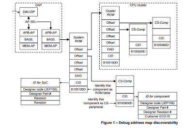
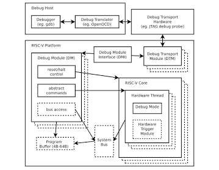

## 第 1 章：物理与链路层（信号与帧）
- ## 1.1 JTAG 接口引脚定义与电气特性
- JTAG（Joint Test Action Group，IEEE 1149.1）定义的不仅仅是一套调试协议，还规定了**标准接口引脚、电气时序以及状态机**。对于 MCU、SoC、FPGA、CPU 等芯片而言，JTAG 接口通常由 **4 根必需信号 + 1 根可选信号 + 若干辅助信号**组成。
- ### 1.1.1 JTAG 标准引脚定义
- 最常见的是 **20 Pin（ARM）、10 Pin Cortex、14 Pin TI、16 Pin MIPS** 等接口，但真正属于 IEEE1149.1 标准的只有下面几个信号。
  | -    | 引脚             | 全称         | 方向（目标芯片） | 功能 |
  | ---- | ---------------- | ------------ | ---------------- |
  | TCK  | Test Clock       | 输入         | JTAG 时钟        |
  | TMS  | Test Mode Select | 输入         | TAP 状态机控制   |
  | TDI  | Test Data In     | 输入         | 串行输入数据     |
  | TDO  | Test Data Out    | 输出         | 串行输出数据     |
  | TRST | Test Reset       | 输入（可选） | TAP 复位         |
- 除此之外一般还有：
  
  | 引脚   | 作用             |
  | ------ | ---------------- |
  | GND    | 地               |
  | VTREF  | 目标板IO参考电压 |
  | nRESET | 芯片系统复位     |
  | NC     | 保留             |
- ### 1.1.2各引脚详细说明
- **1. TCK（Test Clock）**
- 所有 JTAG 操作均由 TCK 驱动。
- 每个 TCK 上升沿：
	- 状态机变化
	- 数据移位
	- 指令更新
- 通常：1MHz、5MHz、10MHz、20MHz、50MHz
- 高速 FPGA 可以达到：100MHz+
- 电气要求
	- 输入数字时钟：VIL、VIH
	- 通常：CMOS、LVTTL
- **2. TMS（Test Mode Select）**
- 这是最重要的一根线。它控制：TAP State Machine（TAP状态机）
	- 例如：
	- ```
	    Run-Test/Idle
	    ↓
	    Shift-IR
	    ↓
	    Shift-DR
	    ↓
	    Update-DR
	  ```
- 整个 TAP 状态全部由：TMS+TCK决定。
	- 例如：
	- ```
	    TMS=1
	    Test-Logic-Reset
	    ↓
	    Run-Test
	    ↓
	    Select-DR
	    ↓
	    Select-IR
	    ```
- **3. TDI（Test Data In）**
	- 调试器发送数据：
	- ```
	  Debugger
	  ↓
	  TDI
	  ↓
	  Instruction Register
	  ↓
	  Data Register
	  ```
	- 例如发送：
	- ```
	  EXTEST
	  IDCODE
	  BYPASS
	  ```
	- 或者：
	- ```
	  CPU Debug Command
	  ```
	- 都是经 TDI。
- **4. TDO（Test Data Out）**
- 芯片返回：
- ```
  IDCODE
  CPU寄存器
  Memory
  Trace数据（部分实现）
  ```
- 都是：
- ```
  TDO
  ↓
  Debugger
  ```
- TDO 只在：Shift-IR、Shift-DR状态输出有效。
- 其它时间一般：High-Z方便多个器件级联。
- **5. TRST（Test Reset）**
- 这是可选引脚。
- 作用：立即复位 TAP。否则只能：
- ```
  TMS=1
  连续5个TCK
  进入 Reset
  ```
- 所以很多 MCU没有 TRST
- ARM Cortex-M 基本不用 TRST。
- ### 1.1.3JTAG 电气特性
- IEEE1149.1 并**没有规定具体电压值**，只规定逻辑行为，因此实际电气特性由芯片 I/O 标准决定。
- **输入电压**
	- 例如：
	- 3.3V CMOS
	- ```
	  VIH ≥ 2.0V
	  VIL ≤ 0.8V
	  ```
	- 1.8V IO：
	- ```
	  VIH≈1.2V
	  VIL≈0.4V
	  ```
- 所以：**JTAG 调试器必须适配目标板 IO 电压**。这也是为什么调试器都有：VTRE
- 这是很多人误解的一根线。注意：不是供电；而是：Reference Voltage
	- 例如：
	- 目标板：1.8V；调试器读取：VTREF=1.8V
	- 于是，输出：
	- ```
	  TCK
	  TMS
	  TDI
	  ```
	- 全部变成：1.8V；而不是：3.3V；否则会烧芯片。
- **输入阻抗**
	- 通常：几十 kΩ，甚至100kΩ；内部：Pull-up、Pull-down
	- TDO 驱动能力
	- 一般：CMOS Push-Pull；输出：2\~8mA。不同厂家不同。
- ### 1.1.4 JTAG 时序关系
- 一次 Shift 操作示意：
  
  ```
  TCK
  
  __    __    __
  |  |__|  |__|  |__
  
  TMS
  
  0---------------
  
  TDI
  
  1---0---1---1---
  
  TDO
  
  x---1---0---1---
  
  ```
- 通常：
	- TDI 在 TCK 上升沿前建立（Setup）
	- TDI 在上升沿被采样
	- TDO 在下降沿或随后一段传播延迟后更新（具体实现依芯片而定）
	- 调试器在下一次采样窗口读取 TDO
- ### 1.1.5 JTAG 接口典型连接
  
  ```
          Debugger
        ┌────────────┐
        │            │
  TCK ----┤------------├----> MCU
  TMS ----┤------------├----> MCU
  TDI ----┤------------├----> MCU
  TDO <---┤------------├-----
  TRST----┤------------├----> MCU
  RESET---┤------------├----> nRESET
  VTREF<--┤------------├-----
  GND -----┤------------├-----
        └────────────┘
  
  ```
- ### 1.1.6 JTAG 引脚级联（Daisy Chain）
  
  JTAG 支持多个器件共享同一组控制信号。
  
  ```
           TCK
  ────────────┬────────────┬──────────
  
           TMS
  ────────────┬────────────┬──────────
  
  TDI
  ↓
  
  +--------+
  | Device1|
  +--------+
    │
    ▼
  +--------+
  | Device2|
  +--------+
    │
    ▼
  +--------+
  | Device3|
  +--------+
    │
    ▼
  TDO
  
  ```
  
  其中：
- **TCK**：所有器件共享。
- **TMS**：所有器件共享。
- **TDI**：串联进入第一个器件。
- **TDO**：前一个器件连接到后一个器件的 TDI，最后一个器件的 TDO 返回调试器。
- ### 1.1.7 JTAG 与 SWD 引脚对比
  
  | 功能     | JTAG         | SWD                   |
  | -------- | ------------ | --------------------- |
  | 时钟     | TCK          | SWCLK                 |
  | 模式控制 | TMS          | 与数据复用为 SWDIO    |
  | 数据输入 | TDI          | SWDIO                 |
  | 数据输出 | TDO          | SWDIO                 |
  | 复位     | TRST（可选） | 无                    |
  | 系统复位 | nRESET       | nRESET                |
  | 最少信号 | 4～5 根      | 2 根（SWCLK、SWDIO）  |
  | 支持级联 | 是           | 否                    |
  | 标准     | IEEE 1149.1  | ARM Serial Wire Debug |
- ## 1.2 JTAG TAP 控制器 16 状态机状态转移详解
- 在 JTAG（IEEE 1149.1）标准中，**TAP（Test Access Port）控制器**是一个极其核心的同步有限状态机（FSM）。它拥有 **16 个状态**，仅通过一个控制信号线 **TMS（Test Mode Select）** 在时钟信号 **TCK** 的上升沿跳变来控制整个芯片的测试行为。
- 这 16 个状态在结构上呈现高度的**对称性**：除了公用的复位和空闲状态外，其余状态被平分为两大分支 —— **DR（数据寄存器）分支**和 **IR（指令寄存器）分支**。
  
  
- ### 1.2.1 核心基础状态（公共部分）
  
  无论目前处于什么状态，只要**连续保持 TMS = 1 达到 5 个 TCK 时钟周期**，状态机必然会强行返回到复位状态，这是一种极具鲁棒性的硬件防死锁设计。
  
  1. Test-Logic-Reset（测试逻辑复位）
- **状态行为**：测试逻辑被禁用，芯片正常的功能逻辑被激活。
- **转移条件**：
	- `TMS = 1`：继续保持在 `Test-Logic-Reset`。
	- `TMS = 0`：进入 `Run-Test/Idle`。
	  1. Run-Test/Idle（运行测试/空闲）
- **状态行为**：测试逻辑的某些内部操作（如自检指令）可在此状态下运行；如果无指令运行，则处于等待、空闲状态。
- **转移条件**：
	- `TMS = 0`：继续保持在 `Run-Test/Idle`。
	- `TMS = 1`：进入 `Select-DR-Scan`，开始启动扫描序列。
- ### 1.2.2 两大对称分支详解
  
  当状态机从空闲状态出来后，它会走到一个“十字路口”。根据 `TMS` 的值，决定是操作**数据**还是操作**指令**。DR 和 IR 两大分支的 7 个状态名字和转换逻辑完全对称。
  
  1. DR 分支（Data Register Scan）
  
  主要用于读写边界扫描链或其他数据寄存器（如 IDCODE、BYPASS）。
- **Select-DR-Scan**：数据寄存器扫描选择。
	- `TMS = 0`：进入 `Capture-DR`（捕获数据）。
	- `TMS = 1`：进入 `Select-IR-Scan`（转向指令寄存器操作）。
- **Capture-DR**：数据捕获。在此状态下，数据寄存器会在时钟上升沿并行地将内部核心逻辑的数据“锁存”进移位寄存器中。
	- `TMS = 0`：进入 `Shift-DR`，准备开始移位。
	- `TMS = 1`：不进行移位，直接跳到 `Exit1-DR`。
- **Shift-DR**：数据移位。在这个状态下，**移位寄存器与外部的 TDI 和 TDO 连通**。每来一个 TCK，数据就会向外移出一位（TDO），同时新数据移入一位（TDI）。
	- `TMS = 0`：**保持在此状态**，持续进行串行移位（这是 JTAG 数据传输最长的阶段）。
	- `TMS = 1`：移位结束，进入 `Exit1-DR`。
- **Exit1-DR**：退出移位状态 1。作为一个过渡状态。
	- `TMS = 0`：进入 `Pause-DR`，暂时挂起移位操作。
	- `TMS = 1`：直接进入 `Update-DR`，更新数据。
- **Pause-DR**：暂停数据移位。当外部测试仪需要等待或重新填充缓冲区时，状态机会在此停滞，**此时移位操作暂停，但数据保留**。
	- `TMS = 0`：保持在 `Pause-DR`。
	- `TMS = 1`：进入 `Exit2-DR`。
- **Exit2-DR**：退出移位状态 2。
	- `TMS = 0`：重新回到 `Shift-DR` 继续移位（实现断点续传）。
	- `TMS = 1`：进入 `Update-DR`。
- **Update-DR**：数据更新。在 TCK 的**下降沿**，移位寄存器中的新数据被并行地写入到数据寄存器的锁存输出端，使其真正生效。
	- `TMS = 0`：回到 `Run-Test/Idle` 状态。
	- `TMS = 1`：回到 `Select-DR-Scan` 状态，开启新一轮扫描。
	  
	  2. IR 分支（Instruction Register Scan）
	  
	  专门用于将测试指令（如 EXTEST, SAMPLE/PRELOAD）载入到指令寄存器中，从而决定随后的 DR 扫描要操作哪一个数据寄存器。
	  
	  其 7 个状态的跳转路径与 DR 分支完全一样：
- **Select-IR-Scan**：指令寄存器扫描选择。
	- `TMS = 0`：进入 `Capture-IR`。
	- `TMS = 1`：进入 `Test-Logic-Reset`（强制复位）。
- **Capture-IR**：指令捕获。将一个固定的状态模式（通常最后两位是 `01`，用作完整性校验）锁存进指令移位寄存器。
	- `TMS = 0` -> `Shift-IR`； `TMS = 1` -> `Exit1-IR`。
- **Shift-IR**：指令移位。将指令串行地从 TDI 移入，同时将捕获的校验位从 TDO 移出。
	- `TMS = 0` -> 保持在 `Shift-IR` 移位； `TMS = 1` -> `Exit1-IR`。
- **Exit1-IR**：退出指令移位过渡状态 1。
	- `TMS = 0` -> `Pause-IR`； `TMS = 1` -> `Update-IR`。
- **Pause-IR**：暂停指令移位。
	- `TMS = 0` -> 保持在 `Pause-IR`； `TMS = 1` -> `Exit2-IR`。
- **Exit2-IR**：退出指令移位过渡状态 2。
	- `TMS = 0` -> 回到 `Shift-IR`； `TMS = 1` -> `Update-IR`。
- **Update-IR**：指令更新。移入的新指令在 TCK **下降沿**锁存生效，芯片的测试行为随即改变。
	- `TMS = 0` -> `Run-Test/Idle`； `TMS = 1` -> `Select-DR-Scan`。
- ### 1.2.3 核心状态速查表
  
  为了方便编写 Verilog 仿真代码或调试软件驱动，状态之间的切换可以用下表归纳：
  
  | 当前状态             | TMS = 0 的下一状态 | TMS = 1 的下一状态 | 核心作用与特点                  |
  | -------------------- | ------------------ | ------------------ | ------------------------------- |
  | **Test-Logic-Reset** | Run-Test/Idle      | Test-Logic-Reset   | 复位状态，保证系统安全          |
  | **Run-Test/Idle**    | Run-Test/Idle      | Select-DR-Scan     | 空闲或测试运行状态              |
  | **Select-DR-Scan**   | Capture-DR         | Select-IR-Scan     | DR 分支路口                     |
  | **Capture-DR**       | Shift-DR           | Exit1-DR           | 硬件值并行锁存进 DR 移位寄存器  |
  | **Shift-DR**         | Shift-DR           | Exit1-DR           | TDI - DR - TDO 串行移位         |
  | **Exit1-DR**         | Pause-DR           | Update-DR          | 移位结束的网关过渡              |
  | **Pause-DR**         | Pause-DR           | Exit2-DR           | 暂停移位，等待测试仪响应        |
  | **Exit2-DR**         | Shift-DR           | Update-DR          | 允许重新移位或直接更新          |
  | **Update-DR**        | Run-Test/Idle      | Select-DR-Scan     | DR 数据在**下降沿**并排输出生效 |
  | **Select-IR-Scan**   | Capture-IR         | Test-Logic-Reset   | IR 分支路口 / 连续 1 进复位     |
  | **Capture-IR**       | Shift-IR           | Exit1-IR           | 固定状态码（如 `01`）锁存进 IR  |
  | **Shift-IR**         | Shift-IR           | Exit1-IR           | TDI - IR - TDO 指令移位         |
  | **Exit1-IR**         | Pause-IR           | Update-IR          | 移位结束的网关过渡              |
  | **Pause-IR**         | Pause-IR           | Exit2-IR           | 暂停指令移位                    |
  | **Exit2-IR**         | Shift-IR           | Update-IR          | 允许重新移位或直接更新          |
  | **Update-IR**        | Run-Test/Idle      | Select-DR-Scan     | 新测试指令在**下降沿**生效      |
- ## 1.3 JTAG 扫描链（Scan Chain）拓扑与多芯片级联原理
- ### 1.3.1 JTAG 核心引脚与状态机基础
  
  在理解拓扑之前，需要明确 JTAG 的 4 个核心信号（以及可选的第 5 个）：
- **TCK (Test Clock):** 测试时钟，同步所有 JTAG 操作。
- **TMS (Test Mode Select):** 测试模式选择，控制每个芯片内部 TAP 控制器（TAP Controller）的状态机跳转。
- **TDI (Test Data In):** 测试数据输入，数据在 TCK 上升沿锁存。
- **TDO (Test Data Out):** 测试数据输出，数据在 TCK 下降沿移出。
- **TRST (Test Reset, 可选):** 异步复位信号，低电平有效。
  
  核心机制：串行移位寄存器
  
  JTAG 的核心本质是一个巨大的、可变长度的**串行移位寄存器**。数据从主控端（Debugger）的 TDI 发出，逐位流经芯片内部的寄存器，最终从 TDO 回传给主控端。
- ### 1.3.2 多芯片级联（Daisy Chain）拓扑原理
  
  级联（串联）是多芯片 JTAG 连接最常用、最经济的拓扑结构。它允许调试器仅通过一组 JTAG 引脚控制链上的所有芯片。
  
  1. 物理连接拓扑
  
  在级联结构中，**TMS、TCK、TRST 是并联（广播）的**，而 **TDI 和 TDO 是串联的**。
  
  ```
     [ JTAG Debugger ]
       |   |      |
      TCK TMS    TDI
       |   |      |
       |   |   +--v---------+       +------------+       +------------+
       +---|-->|芯片 A      |       |芯片 B      |       |芯片 C      |
       |   |   |            |       |            |       |            |
       |   +-->|TMS     TDO |======>|TDI     TDO |======>|TDI     TDO |--+
       |       |TCK         |       |TCK         |       |TCK         |  |
       +------>|TCK         |       |TCK         |       |TCK         |  |
               +------------+       +------------+       +------------+  |
                                                                         |
                                                                         |
     TDO <===============================================================+
  
  ```
- **TCK/TMS 广播：** 意味着链上的**所有芯片在同一时刻处于完全相同的 TAP 状态机状态**（例如，同时进入 `Shift-IR` 或 `Shift-DR`）。
- **TDI-TDO 串接：** 数据像流水一样从芯片 A 的 TDO 流入芯片 B 的 TDI。
  
  2. 多芯片级联的工作原理
  
  既然所有芯片的状态机同步跳转，如何做到“只对芯片 B 进行操作，而不影响芯片 A 和 C”？
  
  这依赖于 JTAG 标准定义的指令寄存器（IR）长度以及特殊的 **BYPASS（旁路）** 指令。
  
  ① 什么是 BYPASS（旁路）模式？
  
  当某个芯片被置于 BYPASS 模式时，其内部的 TDI 和 TDO 之间会选通一个**只有 1 位长度的旁路寄存器**（Bypass Register）。此时，移入该芯片的数据只需要延迟 1 个 TCK 周期就会从 TDO 移出。这意味着该芯片对数据流来说变得“近乎透明”。
  
  ② 数据对齐与移位操作步骤
  
  假设链上有 3 片芯片，IR 长度分别为：芯片 A = 4位，芯片 B = 5位，芯片 C = 4位。总 IR 长度 = 13位。
  
  如果我们要向**芯片 B** 写入特定指令，而让芯片 A 和 C 保持旁路，操作流程如下：
- **步骤 1：扫描指令寄存器 (Shift-IR 状态)**&#x8C03;试器需要一次性拼装一个 13 位的串行数据流。为了让 A 和 C 旁路，我们需要将 A 和 C 的对应指令置为全 `1`（IEEE 1149.1 规定，全 `1` 指令强制为 BYPASS 指令）。调试器串行发出这 13 位数据。由于状态机同步，数据精准填充满各芯片的 IR 寄存器。随后状态机跳转至 `Update-IR`，指令正式生效。
	- 芯片 C 的指令（先进入）：`1111` (BYPASS)
	- 芯片 B 的指令（中间）：`10100` (目标操作指令)
	- 芯片 A 的指令（后进入）：`1111` (BYPASS)
- **步骤 2：扫描数据寄存器 (Shift-DR 状态)**&#x6B64;时，芯片 A 和 C 内部选通的是 **1 位的 BYPASS 寄存器**；芯片 B 选通的是其目标指令对应的**数据寄存器（DR）**（假设长度为 32 位）。此时，整条扫描链的总数据长度变为：\$\$\text{总长度} = 1\text{位(A)} + 32\text{位(B)} + 1\text{位(C)} = 34\text{位}\$\$调试器如果要向芯片 B 写入 32 位数据，必须发送 34 位的数据流：数据移位完成后，进入 `Update-DR`，芯片 B 成功捕获 32 位数据，而芯片 A 和 C 仅流过 1 位无意义数据，不改变内部状态。
	- 先发送 1 位哑数据（填充 C 的 BYPASS 位）
	- 再发送 32 位有效数据（目标送往 B 的 DR）
	- 最后发送 1 位哑数据（填充 A 的 BYPASS 位）
- ### 1.3.3 其他 JTAG 拓扑结构
  
  除了级联，为了应对多子卡系统、高可靠性隔离或缩短扫描链长度的需求，还会采用以下拓扑：
  
  1. 星形拓扑（Star Topology / 并联）
  
  每个芯片拥有独立的 TMS 或 TCK 信号，调试器通过片选来决定激活哪一个芯片。
- **连接方式：** 所有芯片的 TDI、TDO、TCK 并联，但 **TMS 独立**（或者 TCK 独立）。调试器选择拉低某个芯片的 TMS，使其进入工作状态，其他芯片的 TMS 保持高电平复位状态，其 TDO 必须处于高阻态（Hi-Z）。
- **优缺点：**
	- *优点*：隔离度高，某一个芯片损坏不影响其他芯片；扫描链短，速度快。
	- *缺点*：消耗主控端更多的引脚，对调试器要求高。
	  
	  2. 基于扫描链路复用器（Scan Bridge / Switch）的拓扑
	  
	  大型系统（如刀片服务器基板）中，常用专门的 JTAG 配置芯片（如 TI 的 SCANSTA 系列或通过 CPLD 动态切换）。
- **原理：** 调试器首先连接到主控 Bridge 芯片，通过向 Bridge 发送指令，动态地将某些子扫描链接入或切出主链。
- **应用场景：** 允许热插拔的系统，当某个子板被拔出时，Bridge 自动将其短路，保证主链不闭合断开。
- ## 1.4 SWD 协议双线半双工通信时序与帧结构
  
  SWD（Serial Wire Debug）可以理解成：**用两根线实现 JTAG Debug Port 的串行访问**。其中：
- **SWCLK**：时钟，由 Host/Debug Probe 单向驱动
- **SWDIO**：双向数据线，由 Host 和 Target 交替驱动
- 通信方式是**半双工（Half-Duplex）**
- 一个典型 SWD 访问由 **Request → ACK → Data** 三部分组成
  * 一个完整的数据传输通常是 **46 个 SWCLK 周期**。
  
  如果你正在从 **JTAG → SWD → DAP → OpenOCD/Debug Probe** 这个方向学习，那么 SWD 时序是非常值得彻底搞清楚的一层。
- ### 1.4.1 SWD 的物理连接
  
  
- 最基本的连接只有：
  
  ```
  Debug Probe                         MCU
  ┌──────────────┐                  ┌──────────────┐
  │              │                  │              │
  │     SWCLK ───┼─────────────────► SWCLK        │
  │              │                  │              │
  │     SWDIO ◄──┼─────────────────► SWDIO        │
  │              │                  │              │
  │      GND ────┼────────────────── GND          │
  │              │                  │              │
  └──────────────┘                  └──────────────┘
  ```
  
  这里最关键的是：
  > **SWCLK 永远由 Host 驱动，而 SWDIO 是双向的。**
  
  所以 SWD 相比 JTAG 少了：TCK、TMS、TDI、TDO；
  变成：SWCLK、SWDIO；
  但它并不是简单地把 JTAG 的 4 根信号线“压缩”成 2 根线，而是重新定义了一套串行 Debug Port 访问协议。
- ### 1.4.2 为什么 SWD 是半双工？
  
  SWDIO 是一根线。
  
  因此不可能出现：
  
  ```
  Host ───────► Target
  Host ◄─────── Target
  ```
  
  同时发生。
  
  而是：
  
  ```
  时间 →
  ─────────────────────────────────────────────►
  
  Host 驱动 SWDIO
       │
       ▼
  ┌──────────────┐
  │   Request    │
  └──────────────┘
       │
       │ Turnaround
       ▼
  Target 驱动 SWDIO
       │
       ▼
  ┌──────────────┐
  │     ACK      │
  └──────────────┘
       │
       │
       ▼
  Target / Host
  根据操作方向驱动
  Data
  
  ```
  
  所以 SWD 的核心问题之一就是：
  
  > **什么时候 Host 驱动 SWDIO，什么时候 Target 驱动 SWDIO？**
  
  这就是 **Turnaround（Trn）** 存在的原因。
- ### 1.4.3 一个 SWD Transaction 的整体结构
  
  一个典型 SWD transaction：
  
  ```
                一个完整 SWD Transaction
  ┌─────────────────────────────────────────────────────┐
  │                                                     │
  │  Request        ACK             Data                │
  │                                                     │
  │  8 bits         3 bits          33 bits             │
  │                                                     │
  │  Host ───────►  Target ───────► Host/Target         │
  │                                                     │
  └─────────────────────────────────────────────────────┘
  ```
  
  其中：Request 8 bit：
  
  ```
  START
  APnDP
  RnW
  A2
  A3
  PARITY
  STOP
  PARK
  ```
  
  也就是：
  
  ```
  1 + 1 + 1 + 2 + 1 + 1 + 1
  = 8 bits
  ```
  
  ACK 3 bit：ACK\[2:0]
  
  Data 32 bit 数据：DATA\[31:0] 再加：PARITY ，所以33 bits
- ### 1.4.4 SWD Request 帧结构
  
  这是 SWD 最重要的一个帧。
  
  ```
  Bit：
  
  7       6       5       4    3    2    1    0
  ┌───────┬───────┬───────┬────┬────┬────┬────┬────┐
  │ PARK  │ STOP  │ PARITY│ A3 │ A2 │ RnW│APnDP│START│
  └───────┴───────┴───────┴────┴────┴────┴────┴────┘
  
  ```
  
  注意一个非常容易混淆的问题：
  
  > **SWD 是 LSB First。**
  
  所以物理线上首先发送的是：
  
  ```
  START
  APnDP
  RnW
  A2
  A3
  PARITY
  STOP
  PARK
  ```
  
  而不是从 Bit7 开始发送。官方资料也明确规定地址字段采用 LSB-first。
- #### 1.4.4.1 START
  
  START 固定：
  
  ```
  START = 1
  ```
  
  作用就是告诉 Target：
  
  > 一个新的 SWD Request 开始了。
- #### 1.4.4.2 APnDP
  
  ```
  APnDP = 0 → DP
  APnDP = 1 → AP
  ```
  
  也就是：
  
  ```
  0 → Debug Port
  1 → Access Port
  ```
  
  所以：
  
  ```
  Host
  │
  │ Request
  │
  ├── APnDP=0 ──► DP
  │
  └── APnDP=1 ──► AP
  ```
  
  这是理解 SWD 和 DAP 关系的关键。
  
  实际上：
  
  ```
  SWD
  │
  ▼
  SWD-DP
  │
  ├── DP Registers
  │
  └── AP
      │
      └── MEM-AP
           │
           └── MCU System Bus
  ```
  
  所以你后面分析 OpenOCD、DAP、Cortex Debug 时，会不断遇到：
  
  ```
  DP
  AP
  MEM-AP
  ```
- #### 1.4.4.3 RnW
  
  ```
  RnW = 1 → Read
  RnW = 0 → Write
  ```
  
  例如：
  
  ```
  APnDP = 0
  RnW   = 1
  ```
  
  表示：
  
  ```
  读取 DP 寄存器
  ```
  
  而：
  
  ```
  APnDP = 1
  RnW   = 0
  ```
  
  表示：
  
  ```
  写 AP 寄存器
  ```
- #### 1.4.4.4 A2 / A3
  
  SWD Request 中只有：
  
  ```
  A[3:2]
  ```
  
  两个地址 bit。
  
  因为 SWD Debug Port / Access Port 的寄存器访问粒度主要是 32-bit，而寄存器地址低两位天然为：
  
  ```
  00
  ```
  
  所以只需要传：
  
  ```
  A3
  A2
  ```
  
  例如：
  
  ```
  A[3:2] = 00
  ```
  
  访问：
  
  ```
  0x0
  ```
  
  ```
  A[3:2] = 01
  ```
  
  访问：
  
  ```
  0x4
  ```
  
  ```
  A[3:2] = 10
  ```
  
  访问：
  
  ```
  0x8
  ```
  
  ```
  A[3:2] = 11
  ```
  
  访问：
  
  ```
  0xC
  ```
- #### 1.4.4.5 PARITY
  
  Request 中的 parity：
  
  ```
  PARITY = parity(APnDP, RnW, A2, A3)
  
  ```
  
  是**偶校验**。
  
  也就是说：
  
  ```
  APnDP ⊕ RnW ⊕ A2 ⊕ A3 ⊕ PARITY = 0
  
  ```
  
  例如：
  
  ```
  APnDP = 1
  RnW   = 1
  A2    = 0
  A3    = 1
  
  ```
  
  其中有：
  
  ```
  1 + 1 + 0 + 1 = 3
  
  ```
  
  个 1。
  
  为了使总数成为偶数：
  
  ```
  PARITY = 1
  
  ```
- #### 1.4.4.6 STOP 和 PARK
  
  两个固定字段：
  
  ```
  STOP = 0
  PARK = 1
  
  ```
  
  所以 Request 最后两个 bit 永远是：
  
  ```
  0 1
  
  ```
  
  因此一个典型 Request：
  
  ```
  START APnDP RnW A2 A3 PARITY STOP PARK
  1     0    1  0  0    0     0    1
  
  ```
  
  物理线上仍然是从左边的 START 开始发送。
- #### 1.4.4.7 Request → ACK 的关键：Turnaround
  
  这是 SWD 和普通 SPI 最大的区别之一。
  
  Host 发完：
  
  ```
  Request
  
  ```
  
  之后：
  
  ```
  Host
  │
  │ SWDIO = output
  │
  ▼
  ┌────────────┐
  │  Request   │
  └────────────┘
       │
       ▼
   Turnaround
       │
       ▼
  Target
  │
  │ SWDIO = output
  │
  ▼
  ┌────────────┐
  │    ACK     │
  └────────────┘
  
  ```
  
  也就是说：
  
  ```
  Host → Target
  
  ```
  
  切换成：
  
  ```
  Target → Host
  ```
  
  中间必须让双方都释放 SWDIO。
- #### 1.4.4.8 TrN 是什么？
  
  TrN：
  
  ```
  Turnaround
  ```
  
  就是：
  
  > **SWDIO 总线方向切换期间的高阻态时间。**
  
  可以理解成：
  
  ```
  Host Drive
     │
     ▼
     Z
     │
     ▼
  Target Drive
  ```
  
  这里：
  
  ```
  Z = High Impedance
  ```
  
  非常重要。
  
  不能这样：
  
  ```
  Host = 1
  Target = 0
  
       ↓
  
  SWDIO = ？？？
  ```
  
  否则两个输出驱动器可能发生总线争用。
  
  所以必须：
  
  ```
  Host release
      ↓
     Z
      ↓
  Target drive
  ```
- #### 1.4.4.9 ACK 阶段
  
  Target 接管 SWDIO 后发送：
  
  ```
  ACK[2:0]
  ```
  
  常见 ACK：
  
  | ACK   | 含义  |
  | ----- | ----- |
  | `001` | OK    |
  | `010` | WAIT  |
  | `100` | FAULT |
  
  也就是：
  
  ```
  001 → OK
  010 → WAIT
  100 → FAULT
  ```
  
  这三个状态非常重要。
  
  例如：
  
  ```
  Host:
    Request
       │
       ▼
  Target:
    ACK = 001
       │
       ▼
    Data
  ```
  
  表示：
  
  > 请求成功，可以继续数据阶段。
  
  如果：
  
  ```
  ACK = 010
  ```
  
  那么通常意味着：
  
  > Target 当前还不能完成请求。
  
  Debug Probe/Host 通常需要重新发起访问。
- #### 1.4.4.10 Write Transaction
  
  以：
  
  ```
  Write
  
  ```
  
  为例。
  
  完整结构：
  
  ```
                Write Transaction
  
  Host                                      Target
  │                                           │
  │ Request                                   │
  │ 8 bit                                     │
  ├──────────────────────────────────────────►│
  │                                           │
  │              Turnaround                   │
  │───────────────────── Z ─────────────────│
  │                                           │
  │                    ACK                    │
  │◄────────────────── 3 bit ────────────────┤
  │                                           │
  │              Turnaround                   │
  │───────────────────── Z ─────────────────│
  │                                           │
  │ Data                                      │
  │ 32 bit + parity                           │
  ├──────────────────────────────────────────►│
  │                                           │
  
  ```
  
  因此 Write：
  
  ```
  Host → Target
  Request
  
  Target → Host
  ACK
  
  Host → Target
  DATA
  
  ```
  
  这里会出现**两次方向切换**。
  
  ***
- #### 1.4.4.11 Read Transaction
  
  Read 就不一样。
  
  ```
                Read Transaction
  
  Host                                      Target
  │                                           │
  │ Request                                   │
  │ 8 bit                                     │
  ├──────────────────────────────────────────►│
  │                                           │
  │              Turnaround                   │
  │───────────────────── Z ─────────────────│
  │                                           │
  │                    ACK                    │
  │◄────────────────── 3 bit ────────────────┤
  │                                           │
  │                    DATA                   │
  │◄────────────────── 32 bit ───────────────┤
  │                                           │
  │                  PARITY                   │
  │◄──────────────────── 1 ──────────────────┤
  
  ```
  
  所以 Read：
  
  ```
  Host → Target
  Request
  
  Target → Host
  ACK + DATA
  
  ```
  
  只需要一次方向切换。
  
  这也是为什么：
  
  ```
  Write
  
  ```
  
  和：
  
  ```
  Read
  
  ```
  
  的 SWD 时序图并不完全一样。
- ### 1.4.5 为什么一个 Packet 是 46 clocks？
  
  把 Write 算一遍：
  
  ```
  Request
  8 bit
  
  ACK
  3 bit
  
  DATA
  32 bit
  
  Parity
  1 bit
  
  ```
  
  合计：
  
  ```
  8 + 3 + 32 + 1
  = 44 bits
  
  ```
  
  但是还存在：
  
  ```
  Turnaround
  
  ```
  
  因此完整 transaction 通常是：
  
  ```
  46 clocks
  ```
  
  即：
  
  ```
  8
  +
  1/2 turnaround
  +
  3
  +
  1.5 turnaround
  +
  33
  ≈ 46 clocks
  
  ```
  
  具体 TrN 的实现时序非常值得注意：第一次方向切换期间，Target 可以在 SWDCLK 上升沿开始驱动 ACK，因此这一阶段约为半个周期；Write 的 ACK→Data 方向切换则包含更长的 TrN，典型为 1.5 个周期。
- ### 1.4.6 SWD 的时钟边沿
  
  这里也非常容易在自己实现 SWD Probe 时搞错。
  
  一个典型规则是：
  
  Host → Target
  
  Host 在：
  
  ```
  SWDCLK falling edge
  
  ```
  
  附近改变 SWDIO。
  
  Target 在：
  
  ```
  SWDCLK rising edge
  
  ```
  
  采样。
  
  也就是：
  
  ```
          ┌───────┐
  SWCLK ────┘       └───────
          ↑       ↑
        Sample   Sample
  
  ```
  
  而 Target → Host 的数据方向则相应按照协议时序进行驱动/采样。Infineon 的 SWD 时序说明也明确给出了 Host 写数据在下降沿驱动、Target 在下一上升沿读取，以及读数据由 Target 驱动、Host 在后续下降沿读取的规则。
- ### 1.4.7 一个完整的 Read 示例
  
  假设：
  
  ```
  读取 DP 的某个寄存器
  
  ```
  
  Host 首先构造：
  
  ```
  START = 1
  APnDP = 0
  RnW   = 1
  A2    = ...
  A3    = ...
  PARITY = ...
  STOP  = 0
  PARK  = 1
  
  ```
  
  形成：
  
  ```
  ┌──────────────────────────────┐
  │ 1 │ 0 │ 1 │ A2 │ A3 │ P │ 0 │ 1 │
  └──────────────────────────────┘
  
  ```
  
  Host 发送：
  
  ```
  SWDIO
   │
   ├── 1
   ├── 0
   ├── 1
   ├── A2
   ├── A3
   ├── P
   ├── 0
   └── 1
  
  ```
  
  然后：
  
  ```
  Host release SWDIO
          ↓
         TrN
          ↓
  Target drive SWDIO
  
  ```
  
  Target 返回：
  
  ```
  ACK = 001
  ```
  
  也就是：
  
  ```
  OK
  ```
  
  随后 Target 继续发送：
  
  ```
  DATA[0]
  DATA[1]
  ...
  DATA[31]
  PARITY
  ```
  
  最终：
  
  ```
  Host 得到：
  
  ACK = OK
  DATA = 0xXXXXXXXX
  PARITY = 0/1
  ```
- ### 1.4.8 SWD 的“帧”和 JTAG 的“帧”思维不太一样
  
  这一点对你现在学习 **JTAG → SWD** 特别重要。
  
  JTAG 更容易理解成：
  
  ```
  TAP Controller
     │
     ├── IR Scan
     │
     └── DR Scan
  
  ```
  
  而 SWD 更像：
  
  ```
  SWD Transaction
       │
       ├── Request
       │
       ├── ACK
       │
       └── Data
  
  ```
  
  所以：
  
  ```
  JTAG
  ↓
  TAP State Machine
  ↓
  IR/DR Scan
  ↓
  Debug Register
  
  ```
  
  而 SWD：
  
  ```
  SWD
  ↓
  SWD Packet
  ↓
  Request
  ↓
  ACK
  ↓
  Data
  ↓
  DP/AP Register
  
  ```
  
  这也是为什么在你的 **JTAG/SWD Debug Probe** 设计中，可以把底层抽象成：
  
  ```
  ┌───────────────────────────────┐
  │       Debug Transport         │
  ├───────────────────────────────┤
  │ JTAG Transport │ SWD Transport│
  └────────┬───────┴───────┬──────┘
         │               │
         ▼               ▼
      JTAG TAP          SWD
         │               │
         └───────┬───────┘
                 ▼
              DAP / DP
                 │
          ┌──────┴──────┐
          ▼             ▼
         AP             DP
          │
       MEM-AP
          │
          ▼
      System Bus
  
  ```
  
  如果把整个 SWD 通信压缩成一张图：
  
  ```
                 SWD WRITE
                   
  Host                                          Target
  │                                               │
  │────── Request 8bit ─────────────────────────►│
  │                                               │
  │────────────── TrN ────────────────           │
  │                                               │
  │◄──────────── ACK 3bit ───────────────────────│
  │                                               │
  │────────────── TrN ────────────────           │
  │                                               │
  │────── DATA 32bit + PARITY ─────────────────►│
  │                                               │
  
  
                 SWD READ
  
  Host                                          Target
  │                                               │
  │────── Request 8bit ─────────────────────────►│
  │                                               │
  │────────────── TrN ────────────────           │
  │                                               │
  │◄──────────── ACK 3bit ───────────────────────│
  │                                               │
  │◄──────────── DATA 32bit ─────────────────────│
  │◄──────────── PARITY ─────────────────────────│
  │                                               │
  
  ```
  
  其中最核心的三个知识点就是：
  
  ```
  ① SWDIO 是双向线
        ↓
  ② Host / Target 必须通过 TrN 进行方向切换
        ↓
  ③ 每次访问都是 Request → ACK → Data
  
  ```
  
  而再往上层就是：
  
  ```
  SWD
  ↓
  SWD-DP
  ↓
  DP Register / AP
  ↓
  MEM-AP
  ↓
  AHB/APB/System Bus
  ↓
  CPU / Memory / Peripheral
  
  ```
- ## 1.5 JTAG 与 SWD 模式切换序列（Line Reset / Select Code）
  
  这个问题是理解 **ARM Debug Port 从 JTAG-DP 切换到 SW-DP** 的关键。
  
  需要先明确一点：
  
  > **JTAG ↔ SWD 的切换，不是通过某个普通寄存器配置完成的，而是通过 SWJ-DP（Serial Wire/JTAG Debug Port）识别的特殊时序序列完成的。**
  
  典型 Cortex-M 调试器连接时，会经历：
  
  ```
  上电
  │
  ▼
  JTAG 模式
  │
  │ 发送 SWJ Switch Sequence
  ▼
  SWD 模式
  │
  ▼
  SW-DP
  │
  ▼
  AP / MEM-AP
  │
  ▼
  MCU
  ```
- ### 1.5.1 为什么需要模式切换？
  
  ARM Cortex-M 的 Debug Port 可以支持两种物理调试接口：
  
  ```
                 SWJ-DP
                   │
          ┌────────┴────────┐
          │                 │
       JTAG-DP            SW-DP
          │                 │
     TCK/TMS/TDI/TDO     SWCLK/SWDIO
  
  ```
  
  也就是说，同一个 Debug Port：JTAG-DP和SW-DP共存。
  
  复用关系通常是：
  
  ```
  JTAG              SWD
  ────              ───
  TCK      ↔        SWCLK
  TMS      ↔        SWDIO
  TDI
  TDO
  nRESET
  ```
  
  所以 MCU 并不知道你究竟想使用：JTAG还是SWD，必须通过特殊序列告诉它。
- ### 1.5.2 SWJ Switch Sequence
  
  最经典的：JTAG → SWD，切换序列是：
  
  ```
  SWDIO:
    50 个连续的 1
          ↓
    16-bit JTAG-to-SWD
          ↓
    至少 2 个 idle cycle
  
  ```
  
  也就是：
  
  ```
  ┌────────────────────┐
  │ 50 × 1             │
  └─────────┬──────────┘
          ↓
  ┌────────────────────┐
  │ JTAG → SWD sequence│
  │      0xE79E        │
  └─────────┬──────────┘
          ↓
  ┌────────────────────┐
  │ idle ≥ 2 clocks    │
  └────────────────────┘
  
  ```
  
  这里有一个**非常容易踩坑的地方**：
  
  > `0xE79E` 是按 SWD/JTAG switch sequence 的位发送规则描述的，不能简单理解成“在 SWDIO 上先发送 0xE7，再发送 0x9E”。
  
  实际发送时需要按照 **LSB-first** 的方式发送这个 16-bit 序列。
- ### 1.5.3 为什么要先发送 50 个 1？
  
  这是为了让 Debug Port 进入一个**确定状态**。
  
  可以理解为：
  
  ```
  SWDIO = 1
  SWCLK ↑
  SWDIO = 1
  SWCLK ↑
  SWDIO = 1
  SWCLK ↑
  ...
  
  ```
  
  连续：≥ 50 cycles，之后：JTAG TAP
  
  会被置于一种不会误识别普通 JTAG 操作的状态。
  
  这一步可以理解成：
  
  > **Synchronize / Reset the interface state**
  
  所以一个可靠的 Debug Probe 在尝试切换接口之前，通常都会先发送大量 `1`。
  
  ***
- ### 1.5.4 JTAG → SWD 的完整序列
  
  假设当前 MCU 处于：JTAG mode
  
  Host Debug Probe，想切换成：SWD mode
  
  那么：
  
  ```
  SWDIO
  │
  │ 11111111111111111111111111111111111111111111111111
  │  └──────────── 50 × 1 ──────────────────────────┘
  │
  │  JTAG → SWD sequence
  │
  │  0xE79E
  │
  │  Idle
  │
  ▼
  SWD mode
  ```
  
  时钟：
  
  ```
  SWCLK
  ↑ ↓ ↑ ↓ ↑ ↓ ↑ ↓ ↑ ↓ ...
  ```
  
  这里 **SWCLK 必须继续提供时钟**，因为 SWDIO 上的序列本质上仍然是一个串行协议操作。
- ### 1.5.5 `0xE79E` 到底怎么发送？
  
  这是学习 SWD 时特别值得搞清楚的一个细节。
  
  假设：0xE79E
  
  二进制：
  
  ```
  1110 0111 1001 1110
  
  ```
  
  如果按照 MSB-first：
  
  ```
  1110011110011110
  ```
  
  但 SWD/SWJ sequence 的发送是：LSB-first
  
  所以实际 bit 顺序是：0111100111100111
  
  也就是：
  
  ```
  0 1 1 1 1 0 0 1 1 1 1 0 0 1 1 1
  ```
  
  因此实现一个 Probe 时，不能简单：send\_u16(0xE79E);
  
  然后默认硬件会按照你想要的方向发送。
  
  必须确认底层 SPI/GPIO/FPGA：bit order
  
  到底是什么。
- ### 1.5.6 切换后为什么还要 Idle？
  
  切换序列之后通常需要：至少 2 个 clock cycles的 idle。
  
  可以理解为：
  
  ```
  Switch Sequence
      │
      ▼
  ┌─────────┐
  │ Idle    │
  │  ≥2 clk │
  └────┬────┘
      ▼
   SW-DP
  
  ```
  
  这样 Target 有时间完成：JTAG-DP->SW-DP接口状态切换。
- ### 1.5.7 SWD → JTAG
  
  反过来也可以：
  
  ```
  SWD
  ↓
  JTAG
  ```
  
  使用：50 × 1，之后发送：JTAG-to-SWD switch sequence 的反向序列
  
  经典序列为：0xE73C，然后：≥ 2 idle clocks
  
  所以可以记成：
  
  ```
          50 × 1
             │
     ┌───────┴────────┐
     │                │
     ▼                ▼
  JTAG → SWD        SWD → JTAG
     │                │
   0xE79E           0xE73C
     │                │
     └───────┬────────┘
             ▼
          Idle ≥2
  
  ```
- ### 1.5.8 一个实际 Debug Probe 的初始化流程
  
  如果你以后自己实现一个类似 **J-Link/OpenOCD Debug Probe** 的底层驱动，这个流程就非常重要。
  
  典型流程可以是：
  
  ```
  ① Probe 上电
       │
       ▼
  ② SWCLK 输出
       │
       ▼
  ③ SWDIO 输出
       │
       ▼
  ④ 发送 ≥50 个 1
       │
       ▼
  ⑤ 发送 JTAG → SWD Switch Sequence
       │
       ▼
  ⑥ SWDIO 释放
       │
       ▼
  ⑦ Idle ≥2 clocks
       │
       ▼
  ⑧ 开始 SWD transaction
       │
       ▼
  ⑨ 读取 DP IDCODE
       │
       ▼
  ⑩ 初始化 DP
       │
       ▼
  ⑪ 初始化 AP
       │
       ▼
  ⑫ MEM-AP
       │
       ▼
  ⑬ 访问 MCU Memory / Core Register
  
  ```
  
  其中：读取 DP IDCODE是非常重要的验证步骤。
  
  如果你切换 SWD 后能够正确读到：DP IDCODE
  
  基本就可以证明：
  
  ```
  SWDIO
  SWCLK
  SWJ switch
  SWD transaction
  SW-DP
  ```
  
  整个链路基本已经工作。
- # 第 2 章：硬件抽象层（调试器与驱动）
- ## 2.1 ARM ADI（v5/v6）架构中的 DP 与 AP 访问原理
  
  ARM ADI（Debug Interface Specification）规范定义了外部调试器与芯片内部 CoreSight 调试组件通信的架构。整体核心是由 **Debug Access Port (DAP)** 构成的两级分层访问机制：外部连接控制 **DP (Debug Port)**，再由 DP 路由控制多个 **AP (Access Port)** 访问芯片内部的总线与组件。
  
    
  
  **1. 架构分层职责**
  
  * **Debug Port (DP):** 负责处理外部物理协议（SWD、JTAG 或 ADIv6 中的 SWJ-DP/MIN-DP），提供对调试器本身控制寄存器（如上电、选择 AP）的直接访问。
  * **Access Port (AP):** 负责对接芯片内部的系统总线或调试组件。常见的有 **MEM-AP**（通过 AHB/AXI/APB 总线直接读写内存及外设）和 **JTAG-AP**。
  
  **2. DP 访问原理**
  
  DP 寄存器空间很小（通常只暴露 4 个地址偏移：`0x0`, `0x4`, `0x8`, `0xC`），通过内部 **SELECT 寄存器** 实现分页与寻址：
  
  * **SELECT 寄存器（DP 偏移 0x8）:**
  * **APSEL:** 选择当前要操作的 AP 端口索引（最多支持 256 个 AP）。
  * **APBANKSEL \[7:4]:** 选择当前 AP 内部的寄存器页（Bank）。
  * **DPBANKSEL \[3:0]:** 选择 DP 自身的寄存器页（ADIv5/v6 用于扩展 DP 寄存器）。
  * **常规 DP 访问流程:**
  1. 调试器向 DP 发送硬件级别的协议命令（如 SWD 读写请求）。
  2. 读写 `DP0x00`（IDCODE）、`DP0x04`（CTRL/STAT，用于给 Debug 系统供电及状态查询）、`DP0x08`（SELECT）和 `DP0x0C`（RDBUFF，读取缓冲）。
  
  **3. AP 访问原理**
  
  AP 寄存器无法直接通过物理总线的线缆指令读写，必须**借助 DP 间接透传**：
  
  1. **设置寻址目标:** 调试器写入 `DP SELECT` 寄存器，设定 `APSEL`（目标 AP）和 `APBANKSEL`（目标页）。
  2. **发出 AP 访问命令:** 物理层发起对 AP 寄存器的读写指令（如 SWD 的 `APnDP=1` 访问标志）。
  3. **读写解耦 (Pipeline 机制):**
   * **写 AP:** 数据通过 DP 传输直接写入目标 AP 寄存器。
   * **读 AP:** 读 AP 寄存器是**两阶段异步**的。发起 AP 读指令后，AP 将数据打入 DP 的 `RDBUFF`，此时物理线上返回的数据往往是上一次传输的旧值；调试器需紧接着读取 `DP RDBUFF`（`DP 0x0C`）才能拿到真实的 AP 读结果。
  
  **4. 典型场景：通过 MEM-AP 读写内存**
  
  读写芯片 RAM 或外设寄存器是调试中最常见的 AP 操作，依靠 MEM-AP 内部的 4 个核心寄存器实现：
  
  |                                     |                                                                     |
  | ----------------------------------- | ------------------------------------------------------------------- |
  | **CSW (Control/Status Word)**       | 配置传输属性（如数据位宽 8/16/32-bit、地址自动递增模式）            |
  | **TAR (Transfer Address Register)** | 写入要访问的芯片物理内存地址（如 `0x20000000`）                     |
  | **DRW (Data Read/Write)**           | 读写数据的通道。写入即发起写内存，读取（结合 `RDBUFF`）即发起读内存 |
  | **BD0\~BD3 (Banked Data)**          | 配合地址自动递增进行高效块传输                                      |
  
  **读内存操作示例步骤:**
  
  1. 配置 `DP SELECT` 选中 MEM-AP 及对应 Bank。
  2. 写 `CSW` 配置为 32-bit 自动递增模式。
  3. 写 `TAR` = `0x20000000`（设置目标起始地址）。
  4. 读 `DRW`（触发 MEM-AP 向总线发起总线读，同时启动 DP 传输）。
  5. 读 `DP RDBUFF`（或连续读取下一个 `DRW`）获取真正从 `0x20000000` 读出的数据。
- ## 2.2 RISCV DTM访问原理
- 
- RISC-V 的核心访问链条可以概括为：**DTM (物理连接) ➔ DMI (内部总线) ➔ DM (控制核心) ➔ Hart (CPU核) / System Bus (内存)**。
- ### 2.2.1. 核心架构组件及职责
  
  |                                      |                                      |                                                                                                                                                                |
  | ------------------------------------ | ------------------------------------ | -------------------------------------------------------------------------------------------------------------------------------------------------------------- |
  | **DTM***(Debug Transport Module)*    | **DP**                               | **物理传输模块**。对接外部物理总线（JTAG、cJTAG 或 USB 等），负责解包外部物理信号，并转换为芯片内部统一的 **DMI** 总线事务。                                   |
  | **DMI***(Debug Transport Interface)* | 相当于 DP 与 AP 之间的内部总线       | **调试传输接口**。一条极简的内部读写总线，包含 Address（通常 7-12 bit）、Data（32 bit）和 Operation（Read/Write/NOP）。                                        |
  | **DM***(Debug Module)*               | 类似于 **MEM-AP / Core-AP** 的集合体 | **调试核心模块**。包含控制 CPU 停机/单步的寄存器、抽象命令接口（Abstract Commands）、程序缓冲区（Program Buffer）以及系统总线访问控制器（System Bus Access）。 |
  | **Hart***(Hardware Thread)*          | **CPU Core**                         | RISC-V 规范中的硬件线程/处理器核心。DM 通过发送控制信号或注入指令来操作 Hart。                                                                                 |
- ### 2.2.2. DTM ➔ DMI 的访问原理
  
  外部调试器（如 OpenOCD / J-Link）无法直接操作 DM，必须先经过 DTM 翻译：
  
  1. **JTAG IR / DR 操作**：以常见的 JTAG DTM 为例，TAP 控制器定义了特殊的 JTAG 寄存器，如 `dtmcs`（DTM 控制和状态）和 `dmi`（DMI 访问寄存器）。
  2. **通过 DMI 寄存器发起请求**：调试器将 `[Address, Data, Opcode]` 打包移入 JTAG 的 `dmi` 寄存器：
   * `Opcode = 1`：读操作 (Read)
   * `Opcode = 2`：写操作 (Write)
  3. **两阶段读机制**：与 ARM 的 `RDBUFF` 异步读类似，RISC-V 发起 DMI Read 请求后，DTM 会异步去读 DM；调试器在下一个 JTAG 扫描周期才能从 `dmi` 寄存器中把读到的数据移出。
- ### 2.2.3. DM 内部的两种主流访问机制
  
  选中 DM 后，调试器如何控制 CPU 或读写内存？RISC-V 提供了两种互补机制：
- #### 2.2.3.1. **机制 A：抽象命令 (Abstract Commands) —— 控制与寄存器访问**
  
  调试器通过读写 DM 内部固定的 **Abstract Command 寄存器组** 来控制 Hart 或访问 CPU 内部通用寄存器（`x0`-`x31`）、CSR 等：
  
  1. **设置目标**：写 `dmcontrol` 寄存器中的 `hartsel`，选中当前要调试的 Hart。
  2. **发起 Abstract Cmd**：写 `command` 寄存器，设定动作（如“读取寄存器 `x10`”）。
  3. **获取结果**：检查 `abstractcs` 中的 `busy` 标志；完成后从 `data0` 寄存器直接取出 `x10` 的值。
  
  > **停止/复位 Hart**：也是通过写 `dmcontrol` 寄存器的 `haltreq`（暂停）、`resethaltreq`（复位后立即暂停）等控制位实现。
- #### 2.2.3.2. **机制 B：程序缓冲区 (Program Buffer) & 系统总线 (SBA) —— 内存访问**
  
  读写 RAM 或外设寄存器通常有两种途径：
  
  1. **Program Buffer (PBuf) 注入执行**：
   * DM 内部包含一小块 SRAM（通常 2\~8 条指令大小）。
   * 调试器将几条正常的 RISC-V 汇编指令（如 `lw x10, 0(x11)`）写入 Program Buffer。
   * DM 强制让 Hart 执行这几条指令，从而借助 CPU 自身的能力读写内存。
  2. **System Bus Access (SBA) 直接总线访问**（类似于 ARM 的 MEM-AP）：
   * 如果 DM 硬件集成了 SBA 模块，DM 自身就具备直接接管系统总线（如 AHB/AXI/TileLink）的能力。
   * 调试器设置 `sbaddress0`（目标物理地址），读写 `sbdata0` 即可直接触发总线读写，**无需打扰 CPU 执行**。
- ## 2.3 CMSIS-DAP协议解析
  
  **CMSIS-DAP**（Cortex Microcontroller Software Interface Standard - Debug Access Port）是 ARM 官方推出的开源调试协议标准，用于将上位机（PC）的调试指令转换为目标芯片（ARM Cortex 内核）的 SWD/JTAG 信号。
- ### 2.3.1. 协议核心架构
  
  CMSIS-DAP 位于 Host（PC 调试软件，如 Keil、OpenOCD）与 Target（目标 MCU）之间，扮演传输桥梁的角色：
  
  * **上位机 (Host PC)**：通过 USB 发送预设的 DAP 命令（Command Packet）。
  * **固件 (DAP Firmware)**：运行在 MCU 上，解析 USB 命令并驱动 GPIO/硬件外设产生 SWD 或 JTAG 时序。
  * **目标板 (Target Device)**：通过 SWD/JTAG 接口连接到 DAP 硬件，响应内存读写、寄存器访问及复位操作。
  
  在 ARM 生态体系中，CMSIS-DAP 占据着**连接软件生态与硬件调试物理层**的核心纽带位置：
  
  ```
  +-------------------------------------------------------------+
  |    上位机 IDE / 调试器 (Keil MDK, OpenOCD, CLion, VS Code)    |
  +-------------------------------------------------------------+
                              │  (1. CMSIS-DAP Command Packet)
                              ▼
  +-------------------------------------------------------------+
  |    调试器 MCU (例如 STM32F103 / RP2040 运行 DAP 固件)         |
  +-------------------------------------------------------------+
                              │  (2. 硬件物理波形)
                              ▼
  +-------------------------------------------------------------+
  |    目标芯片 CoreSight 架构 (DP -> AP -> Memory/CPU Regs)     |
  +-------------------------------------------------------------+
  
  ```
  
  1. **破除私有厂商壁垒**：在 CMSIS-DAP 出现前，主流调试器协议多为闭源私有（如 J-Link 的 JTAG 封装协议、ST-Link 专有协议）。CMSIS-DAP 作为 **ARM 官方开源标准**，让任何硬件厂商和开发者都能零授权费实现标准的调试器。
  2. **连接 IDE 与物理硬件的“翻译官”**：上位机（如 OpenOCD、Keil）无需了解具体的 USB 读写细节和微控制器 GPIO 翻转逻辑，只需打包标准 DAP 命令；硬件端则只需专注于把 DAP 命令高效翻译成物理 SWD/JTAG 电平。
  3. **CoreSight 系统的透传接口**：它本质上是 ARM **CoreSight 架构**的远程调用协议（RPC）。它通过标准指令直接映射访问目标芯片内部的 **DP（Debug Port）** 和 **AP（Access Port）**，从而实现对 CPU 内核（内核寄存器、断点控制）和系统总线（RAM/Flash）的绝对控制。
- ### 2.3.2. 传输层版本对比 (USB Transport)
  
  CMSIS-DAP 协议定义了指令集，但在 USB 传输层有两个主流版本：
  
  | USB 接口类 | USB HID (Human Interface Device)  | USB WinUSB / Bulk                            |
  | ---------- | --------------------------------- | -------------------------------------------- |
  | 驱动要求   | 免驱（利用操作系统自带 HID 驱动） | 需要 WinUSB 驱动（Windows 10/11 可自动加载） |
  | 传输速度   | 较慢（受到 HID 1ms 轮询周期限制） | 极快（充分利用 USB Bulk 满速/高速带宽）      |
  | 常见应用   | 早期 DAPLink 制作、对速率要求不高 | 现代高性能调试器（如 J-Link 替代方案）       |
- ### 2.3.3. 数据包结构 (Packet Format)
  
  CMSIS-DAP 的通信模式采用 **请求-响应 (Request-Response)** 机制。上位机发送发送数据包（Request），调试器执行后返回应答数据包（Response）。
  
  请求数据包 (Request Packet)
  
  ```
  +-----------------+-------------------+-----------------------+
  |  Command ID     |  Data Byte 1      |  Data Byte 2 ...      |
  |  (1 Byte)       |  (参数/寄存器/地址) |  (有效 Payload 数据)    |
  +-----------------+-------------------+-----------------------+
  
  ```
  
  响应数据包 (Response Packet)
  
  ```
  +-----------------+-------------------+-----------------------+
  |  Command ID     |  Status / Count   |  Return Data ...      |
  |  (1 Byte)       |  (执行状态/成功数) |  (读取到的数据)        |
  +-----------------+-------------------+-----------------------+
  
  ```
- ### 2.3.4. 关键命令分类 (Command Set)
  
  CMSIS-DAP 指令集包含以下几类核心命令：
  
  **通用信息类 (General Information)**
  
  * `DAP_Info (0x00)`：获取调试器的基本信息（固件版本、Vendor 名称、最大 Pack Size 等）。
  * `DAP_Connect (0x02)`：建立调试连接，指定使用 **SWD Mode (1)** 或 **JTAG Mode (2)**。
  * `DAP_Disconnect (0x03)`：断开与目标芯片的连接。
  * `DAP_HostStatus (0x01)`：控制调试器上的 LED（如连接状态灯、运行状态灯）。
  
  **时序与控制类 (Control & Timing)**
  
  * `DAP_Delay (0x09)`：等待指定微秒数。
  * `DAP_ResetTarget (0x0A)`：触发目标芯片复位信号线（RESET 引脚）。
  * `DAP_SWJ_Clock (0x11)`：设置 SWD/JTAG 接口的时钟频率（TCK / SWCLK）。
  
  **核心读写传输 (SWD/JTAG Transfer)**
  
  * `DAP_Transfer (0x05)`：**核心指令**。用于批量执行 SWD/JTAG 的 DP (Debug Port) 或 AP (Access Port) 寄存器读写。
  * 请求中包含一系列 Transfer Request Byte（指定 DP/AP 寄存器地址、读写标志）。
  * 返回实际执行成功的传输次数及读取的数据。
  * `DAP_TransferBlock (0x06)`：用于对单个 DP/AP 寄存器进行**连续块读写**（大大提高了烧录 Flash 和读取大块内存的效率）。
  
  **SWD/JTAG 特有配置**
  
  * `DAP_SWD_Configure (0x13)`：配置 SWD 模式下的数据周转时间（Turnaround Period）、数据校验（Data Phase）等。
  * `DAP_SWJ_Sequence (0x12)`：直接输出自定义的 SWCLK/SWDIO 序列（常用于切换 SWD/JTAG 模式，即 JTAG-to-SWD 序列）。
- ### 2.3.5. 一次典型调试调用的数据流
  
  以 OpenOCD 通过 SWD 模式读取 MCU RAM 内存为例：
  
  1. **握手初始化**：
   * PC 发送 `DAP_Connect (0x02)`\$\rightarrow\$ DAP 初始化 SWD 引脚，返回 `0x01`（成功）。
   * PC 发送 `DAP_SWJ_Clock (0x11, Clock=1000000)`\$\rightarrow\$ 设置 SWCLK 为 1MHz。
   * PC 发送 `DAP_SWJ_Sequence` 刷出复位及 JTAG-to-SWD 切换序列。
  2. **连接调试端口**：
   * PC 发送 `DAP_Transfer (0x05)` 读 DP 的 `IDCODE` 寄存器，验证 CPU 类型（如 Cortex-M4）。
  3. **内存读写**：
   * PC 通过 `DAP_Transfer` 配置 AP 的 `TAR`（Target Address Register）为目标 RAM 地址。
   * PC 发送 `DAP_TransferBlock (0x06)` 批量读取 `DRW`（Data Read/Write Register），把芯片 RAM 内的数据回传给 PC。
- ### 2.3.6. 参考资料
  
  https://arm-software.github.io/CMSIS-DAP/latest/index.html
  
  https://github.com/ARM-software/CMSIS-DAP
- # 第 3 章：调试交互模型（GDB/LLDB 状态机与符号抽象）
- ## 3.1 OpenOCD target抽象层与MCU寄存器映射机制
  
  OpenOCD（Open On-Chip Debugger）的 **Target 抽象层** 与 **MCU 寄存器映射机制** 是其能够跨越不同的 CPU 架构（如 ARM Cortex-M/A/R、RISC-V、MIPS）和各大厂商 MCU，实现统一调试接口的核心架构。
- ### 3.1.1. Target 抽象层架构
  
  OpenOCD 的 Target 抽象层采用面向对象的 C 语言设计设计模式（即通过结构体与函数指针表实现继承与多态），将具体的硬件差异抽象为统一的操作接口。
  
  ```
              ┌───────────────────────────┐
              │   GDB Server / Telnet CLI │
              └─────────────┬─────────────┘
                            │ (调用统一接口)
              ┌─────────────▼─────────────┐
              │   Target Interface (C API) │
              └─────────────┬─────────────┘
                            │
      ┌─────────────────────┼─────────────────────┐
      │                     │                     │
  ┌─────▼──────────┐   ┌──────▼─────────┐   ┌───────▼────────┐
  │ Cortex-M Target│   │ RISC-V Target  │   │  MIPS Target   │
  └─────┬──────────┘   └──────┬─────────┘   └───────┬────────┘
      │                     │                     │
  ┌─────▼──────────┐   ┌──────▼─────────┐   ┌───────▼────────┐
  │  ADI v5 / DP   │   │ RISC-V Debug Module│ MIPS EJTAG    │
  └────────────────┘   └────────────────┘   └────────────────┘
  
  ```
  
  核心数据结构 `struct target`
  
  在源码 `src/target/target.h` 中，`struct target` 定义了一个调试目标的抽象实体。它主要包含三部分：
  
  * **状态与元数据**：如目标状态（`TARGET_RUNNING`, `TARGET_HALTED`, `TARGET_RESET`）、架构类型、内存映射等。
  * **Target Type 函数指针表 (****`struct target_type *type`****)**：多态的核心，声明了所有必须或可选实现的操作（如读写内存、复位、断点控制等）。
  * **架构专属私有数据 (****`void *arch_info`****)**：指向特定架构的上下文结构体，如 `struct armv7m_common` 或 `struct riscv_info`。
  * **`struct target`****（基类实例）**：记录具体芯片的操作状态（`TARGET_HALTED`, `TARGET_RUNNING`）、内核类型、打断点/观察点的链表，以及所属的 `target_type` 指针。
  * **`struct target_type`****（虚函数表 vtable）**：每种内核架构（如 `cortex_m.c`、`riscv-013.c`）都会静态定义一个该类型的结构体变量，包含指向具体 API 实现的函数指针。
  * **架构特定私有结构体（子类数据扩展）**：
  * 对于 ARM Cortex-M：`target->arch_info` 指向 `struct armv7m_common`，其中包含 NVIC（中断控制器）、FPB（硬件断点/重映射单元）、DWT（数据观察点和追踪）等硬件特征。
  * 对于 RISC-V：`target->arch_info` 指向 `struct riscv_info`，包含 Debug Module (DM) 寄存器地址和 abstract command 支持状态。
  
  关键 Target 接口函数
  
  | poll()                              | 查询目标 CPU 当前运行状态 | 读取 Debug Fault Status Register (DFSR)      |
  | ----------------------------------- | ------------------------- | -------------------------------------------- |
  | halt()                              | 强制暂停 CPU 运行         | 向 CoreDebug->DHCSR 写入 Halt 指令           |
  | resume()                            | 恢复运行                  | 还原上下文并向 DHCSR 写入 Debug Key & Enable |
  | read\_memory() / write\_memory()    | 读写目标总线内存空间      | 通过 ADI v5 AP 接口发起 AHB/AXI 总线事务     |
  | read\_phys\_memory()                | 读写物理内存（绕过 MMU）  | 直接调用物理总线访问接口                     |
  | assert\_reset() / deassert\_reset() | 控制硬件/软件复位信号     | 操作 SRST 引脚或触发 NVIC System Reset       |
- ### 3.1.2. MCU 寄存器映射机制
  
  OpenOCD 对 MCU 寄存器的映射分为 **CPU 核心通用寄存器（Core Registers）** 与 **外设/特殊功能寄存器（SFRs / Peripheral Registers）** 两个维度。
  
  CPU 通用寄存器的映射与缓存 (`reg_cache`)
  
  为了让 GDB 能够读取和修改 CPU 寄存器（如 R0\~R15、PC、SP、PSR 等），OpenOCD 建立了统一的寄存器缓存机制。
  
  ```
  GDB (发送 'g' / 'p' 包)
   │
   ▼
  OpenOCD reg_cache ───(缓存有效?)───► [直接返回 Cache 数据]
   │ No
   ▼
  架构专属 read_reg()
   │
   ▼ (以 ARM Cortex-M 为例)
  操作 DCRSR / DCRDR 调试寄存器
   │
   ▼
  硬件 CPU Core 寄存器
  
  ```
  
  * **`struct reg`****&#x20;与&#x20;****`struct reg_cache`**：每个寄存器对应一个 `struct reg`，包含寄存器名称、大小（Bit 宽度）、数据缓冲区指针（`value`）、状态标志（`dirty` 表示已被修改未同步到硬件，`valid` 表示当前缓存值有效）。
  * **延迟写入（Lazy Write）**：当用户在调试器中修改寄存器（如 `set $r0 = 5`）时，OpenOCD 仅更新 `reg_cache` 并将 `dirty` 标志设为 true。直到执行 `resume` 恢复运行前，才一次性刷入硬件。
  * **核心寄存器读取路径**：
  * 在 **ARM Cortex-M** 上：CPU 挂起后，OpenOCD 通过 NVIC 调试组件中的 **DCRSR**（Debug Core Register Selector Register）写入寄存器编号，再从 **DCRDR**（Debug Core Register Data Register）中读取值。
  * 在 **RISC-V** 上：通过 Abstract Control and Status (abstractcs) / Abstract Commands 寄存器执行 `Access Register` 命令读取。
  
  外设映射与总线级寄存器读写（SFR / MMIO）
  
  对于 MCU 的外设控制寄存器（如 RCC、GPIO、UART 等），OpenOCD 采用 **内存映射 I/O (MMIO)** 模型。由于外设寄存器本质上都映射在 CPU 的物理地址空间中，OpenOCD 并不在 C 语言层硬编码每个 MCU 的每个外设寄存器，而是将其归一化为统一的内存总线访问。
  
  读写访问流
  
  当调试器发送读写外设寄存器的请求（例如读取 STM32 的 GPIOA\_ODR `0x48000014`）时：
  
  1. **GDB 协议解析**：GDB 发送 `m` (Read Memory) 或 `M` (Write Memory) 数据包。
  2. **Target 层路由**：OpenOCD 将请求转发给 `target->type->read_memory()`。
  3. **调试接口协议转换**：
   * **ARM 架构**：调用 ADI (ARM Debug Interface) v5/v6 驱动，通过 DP (Debug Port) 选择 AP (Access Port，如 AHB-AP / AXI-AP)，生成标准总线读写传输。
   * **RISC-V 架构**：通过 System Bus Access (SBA) 模块或通过在 Target 上注入执行数据传输指令来完成总线读写。
  4. **硬件响应**：调试器硬件（J-Link / ST-Link / CMSIS-DAP）将请求转换为 SWD 或 JTAG 物理时序，打入 MCU 总线并返回结果。
  
  外设寄存器的定义与可视化（SVD 支持）
  
  虽然 OpenOCD 内核仅处理地址与数据，但为了在 CLI 或 GDB 中直观显示外设寄存器，OpenOCD 提供了对 CMSIS-SVD（System View Description）文件的映射解析能力：
  
  * **SVD 解析**：用户可以在 OpenOCD TCL 配置或前端（如 Cortex-Debug 插件）中装载 MCU 的 `.svd` 文件。
  * **结构化映射**：SVD 文件建立了 `外设名称 -> 基地址 -> 寄存器偏移 -> 位域 (Bitfield)` 的映射表。
  * **交互实现**：当用户请求查看 `GPIOA->ODR` 时，系统自动完成 `0x48000000 + 0x14` 的地址计算，发起 `read_memory()` 获得 32-bit 数据后，再依据 Bitfield 定义解析并打印掩码位。
- ### 3.1.3. 经典响应控制流
- #### 3.1.3.1. 典型的控制响应流：以 Halt（强制暂停 CPU）为例
  
  当调试器或用户发出 `halt` 指令时，OpenOCD 的底层交互步骤如下：
  
  ```
  [User/GDB] -> (发送 'interrupt' 或 'halt')
    │
    ▼
  [target.c] -> target_halt(struct target *target)
    │  (调用虚函数)
    ▼
  [cortex_m.c] -> cortex_m_halt(struct target *target)
    │
    ├─► 1. 读取 NVIC 中的 DHCSR (Debug Halting Control and Status Register)
    │
    ├─► 2. 向 DHCSR 写入 Debug Key (0xA05F) | C_HALT | C_DEBUGEN
    │      └─► 发起 DAP 总线传输写寄存器 `0xE000EDF0`
    │
    └─► 3. 循环调用 poll()，直至 DHCSR 的 S_HALT 位置 1
  ```
- #### 3.1.3.2. 寄存器读写与同步逻辑（三阶段）
  
  阶段 1：内核被挂起 (Halted)
  
  当目标内核进入 `TARGET_HALTED` 状态时，OpenOCD **不会** 立即拉取所有寄存器的值，而是将所有寄存器的 `valid` 和 `dirty` 标志置为 `false`。
  
  阶段 2：读取与修改 (GDB 交互)
  
  * **读取（****`get_reg`****）**：
  * 检查 `reg->valid`。若为 `true`，直接返回 `reg->value`。
  * 若为 `false`，触发 `reg->type->get()`（如 `armv7m_get_core_reg()`）。
  * 从硬件读取值写入 `reg->value`，并设置 `valid = true`。
  * **写入（****`set_reg`****）**：
  * 更新 `reg->value` 的内容。
  * 将 `reg->valid` 置为 `true`，**`reg->dirty`****&#x20;置为&#x20;****`true`**。此时不立刻写入硬件。
  
  阶段 3：恢复运行 (Resume)
  
  在内核重新恢复运行（`target_resume`）前，OpenOCD 会遍历整个 `reg_cache`：
  
  ```
  遍历 reg_cache 中所有的 reg:
  └── 如果 reg->dirty == true:
        ├── 调用 reg->type->set() 将本地 value 写入 CPU 硬件
        └── 重置 reg->dirty = false
  ```
- #### 3.1.3.3. Cortex-M 与 RISC-V 核心寄存器读写硬件细节
  
  由于 CPU 暂停时无法执行普通 `MOV` 或 `LD` 指令，OpenOCD 需要使用硬件调试模块的特殊通路来读取核心寄存器：
  
  * **ARM Cortex-M (通过 CoreDebug 单元)**：
  * 读 R0\~R15、xPSR：写寄存器编号到 `DCRSR` (0xE000EDF4)，触发硬件搬运，然后从 `DCRDR` (0xE000EDF8) 读取 32 位数值。
  * 读 FPU 浮点寄存器（S0\~S31）：利用同样的 `DCRSR/DCRDR` 机制，配合特权选择码。
  * **RISC-V (通过 Debug Module 抽象命令 Abstract Commands)**：
  * 写寄存器选择码与 `Access Register` 命令到 `command` (0x17) 寄存器。
  * 调试模块 (DM) 暂停 CPU 内部流水线，将目标寄存器的值放入 `data0` (0x04) 寄存器。
  * OpenOCD 通过 JTAG/SWD 读取 `data0`。
- ## 3.2 OpenOCD 复位逻辑与时序控制
  
  > 可观测性始于一个确定的起点：目标必须停在可复现的状态上。本小节讨论 OpenOCD 的复位机制，在厘清 SRST 与 TRST 两根复位信号、Cortex-M 三种复位方式的基础上，说明 `reset run / halt / init` 的命令语义、复位事件的触发顺序、复位时序参数的作用，以及 `reset halt` 所面临的时序竞争。
- ### 3.2.1 复位的目标与难点
  
  观测一个 MCU 的运行时行为，前提是先让它停在一个确定、可复现的状态。最理想的状态是「刚上电、时钟刚起、但一条用户代码都还没执行」——只有这样，IDE 才能先设置断点、配置 trace，再放它跑，从而拿到从第一行代码起完整无缺的观测数据。
  
  难点在于复位横跨软硬件：它既涉及探针拉动的 SRST、TRST 两根物理信号，也涉及芯片内部 CoreSight 调试逻辑的复位，还受制于板级电路（复位 RC 延时、按键消抖）与芯片 ROM 上电流程。OpenOCD 之所以把复位拆成这么多可选配置和事件，正是因为它必须面对一个事实——**没有一种复位序列能适配所有板子**。
- ### 3.2.2 SRST 与 TRST 复位信号
  
  OpenOCD 能操控的复位信号只有两根，理解它们的区别是理解后面一切的基础。
  
  **SRST（System Reset,nSRST）** 是系统复位，对应芯片的复位引脚，复位整个芯片——内核、外设、时钟树通常都归零，是「硬复位」的核心手段。**TRST（Test Reset,nTRST）** 只复位 JTAG 的 TAP 控制器（测试逻辑），不影响芯片功能逻辑，作用是把扫描链状态机拉回确定状态。一个值得记住的不对称性：JTAG 协议本身能用 TMS 时序触发「测试逻辑复位」，所以 **TRST 缺失不算问题**；而 SRST 缺失则会严重影响能否可靠地复位目标。
  
  这两根信号在不同板子上的处境千差万别，`reset_config` 就是用来描述这些差异的：
  
  | 维度                  | 可选值                                                         | 含义                                               |
  | --------------------- | -------------------------------------------------------------- | -------------------------------------------------- |
  | signals 信号          | none（默认）/ trst_only / srst_only / trst_and_srst            | 板上实际接了哪根信号                               |
  | combination 组合      | separate（默认）/ srst_pulls_trst / trst_pulls_srst / combined | 两根信号是否互相牵动（如 SRST 拉低也复位测试逻辑） |
  | gates 门控            | srst_gates_jtag（默认）/ srst_nogate                           | SRST 拉低期间是否门控 JTAG 时钟                    |
  | connect_type 连接     | connect_deassert_srst（默认）/ connect_assert_srst             | 连接目标时是否先拉住 SRST                          |
  | trst_type / srst_type | push_pull / open_drain                                         | 信号驱动方式                                       |
  
  其中 **gates 直接决定复位期间能否与目标通信**。默认的 `srst_gates_jtag` 表示 SRST 拉低时 JTAG 时钟被门控、无法通信；而 `srst_nogate` 表示复位期间仍可发 JTAG 命令——这正是 3.1.7 节「复位期间就布置好停住条件」得以成立的前提。`connect_assert_srst` 则提供一条「救命通道」：当目标因选项字节配置错误或跑飞了代码而连不上时，可以先拉住 SRST，让芯片停在复位态再建立调试连接。[citation](https://openocd.org/doc/html/Reset-Configuration.html)
- ### 3.2.3 Cortex-M 的复位方式
- SRST 只是「一种」复位手段。对 Cortex-M 而言，芯片内部还提供两种基于软件机制的复位，OpenOCD 用 `cortex_m reset_config` 来选择：
  
  | 方式        | 机制                       | 复位范围                    | 典型适用                   |
  | ----------- | -------------------------- | --------------------------- | -------------------------- |
  | srst        | 拉动物理 nSRST 引脚        | 整个芯片                    | 板上接了 SRST 时优先       |
  | sysresetreq | 写 AIRCR 的 SYSRESETREQ 位 | 内核 + 外设，调试逻辑不断开 | M0 / M0+ / M1 等无 SRST 时 |
  | vectreset   | 写 AIRCR 的 VECTRESET 位   | 仅内核，外设不受影响        | M3 / M4 / M7 的安全默认    |
  
  这里有三条关键事实。其一，**默认行为是「板上有 SRST 就用 SRST，没有则回退到 VECTRESET」**。其二，Cortex-M0、M0+、M1 **不支持 VECTRESET**——它们没有这条机制的实现，必须改用 SYSRESETREQ。其三，SYSRESETREQ 与 VECTRESET 都属于「软复位」，通过调试访问端口（DAP）写内核寄存器触发，而非拉物理引脚，好处是**调试连接不因此断开**。
  
  代价则落在复位范围上。VECTRESET 只复位内核，外设与时钟全都不动，文档明确建议此时用一个 `reset-init` 事件处理器手动复位外设；不过它被视为 M3/M4/M7 上的「安全选项」。SYSRESETREQ 相当于一次完整的系统复位，同时仍保留调试连接，对可观测性工具而言往往更「干净」。[citation](https://openocd.org/doc/html/Architecture-and-Core-Commands.html)
-
- ### 3.2.4 复位命令的语义
  
  `reset` 命令带一个可选参数，决定复位之后发生什么；不带参数时默认等价于 `reset run`。
- **reset run** —— 复位目标后立即放它运行。多用于固件烧录完成后让新固件开始执行。
- **reset halt** —— 复位后立即停住 CPU，**理想情况下停在复位向量、第一条指令尚未执行之前**。这是调试与可观测性的默认起点。
- **reset init** —— 等价于 `reset halt`，再加上执行 `reset-init` 事件脚本，用于板级初始化（配置 PLL 与时钟、初始化外部 DRAM、设置引脚复用等）。
  
  三者的差别，本质是「复位后让目标走多远」。`reset halt` 看似最干净，但它隐含一个时序假设：**从 SRST 释放到调试逻辑成功让内核停住，这个窗口必须短于目标执行第一条指令所需的时间**。这个假设并不总能成立，3.1.7 节将专门讨论。
  
  （OpenOCD 另外也提供更底层的 `adapter assert` / `adapter deassert` 原语，用于手工构造复位序列。）
-
- ### 3.2.5 复位事件链
- OpenOCD 把一次复位拆成一连串有序的**事件（events）**。每个事件都是一个可挂载 Tcl 处理器的钩子，经 `-event` 配置。想在复位序列的某个精确时刻插入动作——降时钟、写寄存器、加延时——靠的就是这些钩子。完整顺序如下：
  
  1. **reset-start** —— 复位处理的第一步。文档建议在这里用 `jtag_rclk` 或 `adapter speed` 把 JTAG 时钟降到低速，因为复位会关掉 PLL，高速时钟此时尚不可用。
  
  2. **reset-assert-pre** —— 在 SRST 真正拉低（或 `reset-assert` 触发）之前。
  
  3. **reset-assert** —— 若不提供此处理器，内核会去拉 SRST；若提供了，支持该事件的内核会改用它而**不**拉 SRST。这正是「JTAG 适配器没有 SRST 线」或「多目标只想复位其中一个」时的关键机制。
  
  4. **reset-assert-post** —— SRST 已拉低之后。
  
  5. **reset-deassert-pre** —— 准备释放 SRST 之前。
  
  6. **reset-deassert-post** —— SRST 已释放之后（若目标使用了 SRST）。
  
  7. **reset-init** —— 在 `reset-deassert-post` 之后触发，仅被 `reset init` 命令使用，用于板级初始化。
  
  8. **reset-end** —— 复位处理的最后一步。
  
  这条链把「什么时候做什么」完整暴露给板级脚本，也正是同一颗芯片在不同板子上需要不同复位配置的原因。[citation](https://openocd.org/doc/html/CPU-Configuration.html)
- ### 3.2.6 复位时序参数
- 除事件钩子外，OpenOCD 还提供几个直接操控时序的参数，用来应对真实硬件的物理约束：
- **adapter srst pulse_width** <ms> —— nSRST 拉低后**至少要维持**多少毫秒才允许释放，用于满足「复位脉冲不得短于某值」的芯片要求。
- **adapter srst delay** \<ms\> —— nSRST 释放后，OpenOCD 在开始新的 JTAG 操作前要等多少毫秒。板上有复位按键、带硬件消抖时尤其需要。
- **jtag_ntrst_assert_width** <ms> 与 **jtag_ntrst_delay** <ms> —— nTRST 对应的脉冲宽度与释放后延时。
- **srst_gates_jtag / srst_nogate** —— 是否在 SRST 拉低期间门控 JTAG 时钟。
  
  这几项合起来，构成「复位脉冲多宽、释放后等多久、复位期间能不能通信」的完整时序控制。文档特别提醒：复位电路（RC 延时、复位监控芯片、片上特性）可能在适配器停止输出复位之后，仍然**延长**复位效果一段时间——这正是 `adapter srst delay` 存在的意义。[citation](https://openocd.org/doc/html/Reset-Configuration.html)
- ### 3.2.7 reset halt 的时序竞争
- 这是整套复位逻辑里最微妙、也最影响可观测性的一点。
  
  要真正做到 `reset halt`，理想序列是：**先拉住 SRST，再借 TRST 复位 TAP，然后在 SRST 仍被拉住的情况下，通过 JTAG 下达让 CPU 在复位向量处停住的命令；最后才释放 SRST——此时系统已在调试器控制下停稳，一行代码都没跑。**
  
  对 Cortex-M，实现「停在复位向量」的技巧是**向量捕获（Vector Catch,VC_CORERESET）**：在调试异常与监控控制寄存器（DEMCR）里置位，使内核复位后于复位向量处触发调试断点。但它有前提——SRST 拉低期间必须能与 JTAG 通信（即需要 `srst_nogate`），否则无法在释放复位前就把向量捕获布置好。
  
  一旦这个前提不成立，就会退化成那条熟悉的告警：**「srst pulls trst - can not reset into halted mode. Issuing halt after reset.」** 它的含义是——OpenOCD 无法在复位态内让内核停稳，只能先释放复位、等目标跑起来之后再补发一条 halt，**于是目标可能已经执行了若干条指令**，硬件状态未必干净。
  
  一个真实的反例是 PSoC 4：它复位后会先执行系统 ROM 的初始化代码，再跳转到用户 Flash 的复位向量；而这段 ROM 受保护、不可读也不可调试，导致 `VC_CORERESET` 失去作用，`reset halt` 无法按要求停住。这类芯片只能靠 `sysresetreq` 或板级其它手段迂回。可见 `reset halt` 的可靠性高度依赖板级与芯片实现——它不是纯软件动作，而是「探针信号 + 芯片复位流程 + 调试逻辑」三者时序配合的结果。
- ### 3.2.8 典型的 reset halt 序列
- 把上述要素串起来，一次 `reset halt` 大致经历以下步骤：
  
  ```mermaid height=580
  sequenceDiagram
  participant U as GDB / CLI
  participant O as OpenOCD
  participant A as 适配器
  participant T as 目标芯片
  U->>O: reset halt（或 reset init）
  O->>O: reset-start：降低 JTAG / SWD 时钟
  O->>O: reset-assert-pre
  O->>A: adapter assert srst
  A->>T: nSRST 拉低（维持 pulse_width）
  O->>O: reset-assert-post
  Note over O,T: 若为 srst_nogate，复位期间即可扫链
  O->>O: reset-deassert-pre
  O->>A: adapter deassert srst
  A->>T: nSRST 释放
  O->>O: reset-deassert-post（等待 srst delay）
  O->>T: 设置 VC_CORERESET / 请求 halt
  T-->>O: 在复位向量处 halted
  O->>O: reset-init（仅 reset init：配置 PLL / DRAM）
  O->>O: reset-end
  O-->>U: target halted，可开始观测
  ```
  
  请看倒数第四步：如果在 `reset-deassert-post` 之后才去设置向量捕获，就已经存在目标抢先执行代码的窗口。真正干净的 `reset halt`，依赖的是「复位期间就把停住条件布置好」。
- ### 3.2.9 复位正确性对可观测性的影响
- 对可观测性工具而言，复位不是「开始调试」的前置琐事，而是观测数据的**零时刻**。如果 `reset halt` 实际停在了复位后第 N 条指令，那么：
- 断点位置、变量初值会与预期不符，因为它们是在若干条指令之后才被观测到的；
- SWO / ITM trace 的时间轴会缺头——最关键的上电初始化过程根本没被采到；
- 若工具依赖「停在复位向量」来做确定性重放或功耗基线测量，这个前提一旦被打破，结果就不可复现。
  
  因此，成熟的可观测性工具在建立连接后常做的一件事，是**确认自己究竟停在何处**（读 PC、读复位原因），而不是想当然地假定 `reset halt` 一定成功。理解复位事件链与那几项延时参数，也正是为了在出问题时知道该往哪一层去拧。
- ### 3.2.10 复位配置要点
- 回到实践。配置复位时，先分清板上到底接了哪些信号，用 `reset_config` 如实声明——声明错了，后面的时序全都无从谈起。接着在 `reset-start` 里把时钟降到低速，在 `reset-init` 里再把 PLL 与外部存储器配起来（如果用了 `reset init`）。若芯片不支持 VECTRESET（如 M0 / M0+），记得改用 `cortex_m reset_config sysresetreq`。当目标在复位期间无法通信时，要接受 `reset halt` 会退化为「先复位、再 halt」，并据此调整对观测零时刻的预期。最后，遇到「就是复位不对」的疑难板子，不要停留在高层命令上——用 `adapter assert` / `adapter deassert` 与 `jtag arp_*` 原语手工拼出可用时序，再固化成自定义的 `init_reset` 或 `reset-assert` 处理器。
- **OpenOCD 的复位逻辑，本质是在「探针信号时序」与「芯片内部复位流程」之间寻找一个能稳定停在确定性起点的窗口。** `reset_config` 描述硬件差异，复位事件链给出干预时机，延时参数锁定物理约束，三者共同决定可观测性能否从一个干净的零时刻开始。
- ## 3.3 OpenOCD 内存动态烧录算法与 FLASH 实现（Algorithm in RAM）
  
  > 本小节讨论 OpenOCD 如何完成 Flash 编程：它并不在主机侧逐位驱动 Flash 控制器，而是把一小段目标侧代码（算法 / Flash Loader）下载到目标 RAM 中运行，由它完成擦除与写入。这里梳理这一机制的架构、执行流程、接口约定与降级路径。
- ### 3.3.1 问题背景与 Flash 编程约束
- 内存可以像写变量一样直接写入，Flash 却不行。Flash 的写入遵循一套硬性时序：先解锁（unlock），再擦除（erase 把整块置为全 1），然后按页 / 字编程（program 只能把 1 变成 0），每一步之后还要轮询状态寄存器等待操作完成。这些序列不但时序敏感，而且擦除一次可能耗时数百毫秒。
- 如果让主机通过 JTAG / SWD 逐位去驱动 Flash 控制器，会有两个致命问题：一是**极慢**，每次状态轮询都要一趟调试事务；二是**不可靠**，Flash 忙等期间调试接口可能无法保持实时，控制序列极易被打断。OpenOCD 的解法是反过来——把执行这些序列的任务交给目标 CPU 自己：**把一小段专门做 Flash 操作的代码搬进目标 RAM 里运行，主机只负责搬运数据与收集结果。** 这就是所谓「Algorithm in RAM」。
- ### 3.3.2 架构总览
- 理解这套机制，要先把几个对象摆清楚。**Flash 驱动（flash driver）** 是 OpenOCD 里针对某类 Flash 的实现，实现 `erase` / `write` / `protect` 等回调。用户通过 `flash bank <driver> <base> <size> <chip_width> <bus_width> <target> [driver_options]` 声明一个 **Flash Bank**，把某段地址区间绑定到某个驱动与目标上。[citation](https://openocd.org/doc/html/Flash-Commands.html)
- 真正干活的 **算法映像（algorithm / loader）**，是驱动自带的一段目标机器码，源码放在 OpenOCD 的 `contrib/loaders/flash/` 下，编译后被内嵌进驱动（以字节数组形式存在），运行时被写入目标的 **工作区（working area）**——一块从目标 RAM 中划出来的区域。主机与算法之间通过工作区里的一块**参数结构**交换信息。整体关系如下：
- ```mermaid height=460
  flowchart TB
  HOST["OpenOCD 主机侧<br/>flash 驱动 + Flash Bank"] --> WA["目标 RAM 工作区<br/>working area"]
  WA --> ALG["算法映像<br/>(Flash Loader 机器码)"]
  WA --> PARAM["参数块<br/>dest / src / count / status"]
  ALG --> FC["目标 Flash 控制器<br/>/ SPI-QSPI 外设"]
  FC --> FL["NOR / NAND / SPI Flash"]
  ```
  
  这张图的关键在于：**主机与目标之间只有两条数据通路——把字节写进工作区、把结果读回工作区，以及让目标 CPU 去执行算法。** 主机本身从不直接触碰 Flash 控制器寄存器。
- ### 3.3.3 工作区、算法映像与参数块
- 三个对象各司其职。**工作区**是 RAM 中一段被 OpenOCD 预留的区域，通过目标的 `-work-area-phys` / `-work-area-size` 配置；它的大小直接决定了能否启用快速算法。**算法映像**是位置相关或位置无关的目标代码，被写到工作区的固定入口地址；它内部不依赖 libc、不使用向量表，是一个自洽的裸机小程序。**参数块**是一段约定好布局的结构，典型字段包括目标 Flash 地址（dest）、数据缓冲区地址（src）、字节数（count）以及返回状态（status / result）。主机填好参数、把 CPU 的 PC 指向算法入口并放它跑；算法读参数、搬数据、驱动 Flash 控制器，最后把状态写回参数块。
  
  > 这套机制的本质是「主机只做搬运与编排，目标 CPU 做有状态的时序操作」。算法映像相当于一个临时被注入目标 RAM 的、一次性的 Flash 驱动进程——它运行、汇报、退出，然后工作区可被回收或复用。
- ### 3.3.4 烧录执行流程
- 按时间顺序，一次 `flash write_image` 大致经过以下步骤：
  
  1. **准备工作状态**。文档强制的先决条件是：编程前必须先执行 `reset init`，且在编程会话结束前不要再发 `reset` / `reset halt` / `resume`。`program` 脚本会显式地替你调用 `reset init`。[citation](https://openocd.org/doc/html/Flash-Commands.html)
  
  2. **识别与配置**。通过 `flash bank` 配置，`flash probe` 校验并识别 Flash 参数。
  
  3. **分配工作区**。驱动向目标申请一块 RAM 工作区（`target_alloc_working_area`）。若 RAM 已被占用或未初始化，这里就会失败或退化。
  
  4. **下载算法**。驱动把内嵌的算法映像写入工作区入口。
  
  5. **组织参数**。把 dest / src / count 等写进参数块，并把待写数据填入工作区中的数据缓冲区。
  
  6. **启动算法**。把 PC 设为算法入口、配置好所需寄存器，然后恢复目标运行。
  
  7. **等待完成**。主机通过等待接口（`target_wait_algorithm`）等待算法执行完毕——算法在结束时写回状态并抵达约定的退出点。
  
  8. **读回结果**。主机读取状态字段；非零即表示失败，据此报错或重试。
  
  9. **分块循环**。Flash 编程通常按块进行：把映像切成块，对每块重复「填缓冲 → 启动 → 等待 → 读状态」，直到写完，最后按需校验（verify）。
  
  ```mermaid height=520
  sequenceDiagram
  participant U as 用户 / 脚本
  participant O as OpenOCD
  participant RAM as 目标 RAM 工作区
  participant T as 目标 CPU / Flash
  U->>O: reset init
  U->>O: flash write_image erase app.elf
  O->>O: 解析映像 / 推断所属 bank
  O->>RAM: 申请工作区 + 下载算法映像
  loop 按块写入
    O->>RAM: 写参数块 + 待写数据
    O->>T: 设置 PC=算法入口，恢复运行
    T->>T: 执行擦除 / 编程序列
    T->>RAM: 写回状态（完成 / 出错）
    O->>T: 等待退出点 (target_wait_algorithm)
    O->>RAM: 读回状态并校验
  end
  O-->>U: 报告写入字节数与耗时
  ```
- #### 目标侧算法的内部步骤
- 上面是从主机视角看到的编排；把镜头推进到算法映像本身，它「算完一块」的内部序列大致如下：
  
  1. **取参数**。算法入口的第一件事，是从工作区参数块读出目标 Flash 地址（dest）、源数据缓冲地址（src）与字节数（count）。
  
  2. **解锁**。按芯片约定的密钥 / 命令序列写 Flash 控制寄存器，解除写保护——未解锁时，后续任何编程操作都会被控制器忽略。
  
  3. **按需擦除**。若本块涉及擦除，先选定扇区并启动擦除，然后**轮询状态寄存器**，等待忙标志清零、擦除完成位置位。这一步往往是整个流程中最耗时的部分。
  
  4. **逐字编程**。对源缓冲中的每个字（word / halfword）循环：置位编程使能位 → 把数据写到目标地址 → 轮询状态直到本次编程完成 → 检查错误标志（编程错误、写保护错误）。由于写入只能把 1 翻成 0，擦除必须先于编程。
  
  5. **收尾**。关闭编程模式、按需重新加锁，并把结果码写回参数块的 status 字段。
  
  6. **抵达退出点**。跳转到约定的退出点（通常是死循环或断点），让主机据此判定算法结束。
  
  主机与算法之间的「结束握手」正落在第 6 步：主机无需理解算法内部，只要等待目标抵达那个退出点，再读回 status 即可。运行期间算法可以自由占用目标寄存器——它对目标而言就是一段一次性的运行代码，真正需要交还给主机的，只有写进参数块的那个状态。
- 在**异步加载器**里模型稍有不同：主机不再「填一块、等一块」，而是靠双缓冲（乒乓）与算法并行推进——算法处理当前缓冲的同时，下一块数据的投递被重叠进来。但「算法读参数 → 操作 Flash → 写回状态 → 抵达退出点」这条主干并未改变。
- #### 寄存器级实例：STM32 内部 Flash
- 把上面的抽象步骤落到具体寄存器，以 ST 的 FPEC 接口（STM32F1 系列）为例，算法实际操作的寄存器是 `FLASH_KEYR`、`FLASH_CR`、`FLASH_SR` 与 `FLASH_AR`（基址 `0x40022000`）：
  
  | 算法步骤 | 具体寄存器操作 |
  | --- | --- |
  | 解锁 | 依次写 `FLASH_KEYR` = `0x45670123`、`0xCDEF89AB`；密钥序列错误会触发总线错误，并锁定到下次复位 |
  | 等空闲 | 轮询 `FLASH_SR.BSY`（bit0）直到为 0，`BSY` 置位期间不允许写 `FLASH_CR` |
  | 页擦除 | 置 `FLASH_CR.PER`（bit1），把页地址写入 `FLASH_AR`，再置 `FLASH_CR.STRT`（bit6）启动；随后轮询 `FLASH_SR.BSY` |
  | 编程 | 置 `FLASH_CR.PG`（bit0），向目标地址写入半字；随后轮询 `FLASH_SR.BSY` |
  | 查结果 | 读 `FLASH_SR` 的 `EOP`（成功）与 `PGERR` / `WRPRTERR`（出错）；写 1 清除 `EOP` |
  | 收尾 | 清 `FLASH_CR.PG`，如需可置 `FLASH_CR.LOCK`（bit7）重新加锁 |
  
  同族的 STM32F4 接口（基址 `0x40023C00`）整体一致，差异集中在两点：**擦除改用扇区号而非地址**——不写 `FLASH_AR`，而是把扇区号写进 `FLASH_CR.SNB`（bit6:3），再置 `FLASH_CR.SER`（bit1）与 `FLASH_CR.STRT`；**编程位宽可配**——由 `FLASH_CR.PSIZE`（bit9:8）决定按字节 / 半字 / 字写入，状态寄存器则扩展出 `PGAERR`、`PGPERR`、`PGSERR` 等对齐 / 并行度错误位。越往新系列（如 L4、G0），寄存器组织与错误位还会继续分化，这正是 Flash 驱动「一芯片一实现」的根源。[citation](https://github.com/KarpelesLab/rsemu/issues/15)
  
  上面这些动作，正是 OpenOCD 内嵌的那段 Flash Loader 在目标 RAM 里逐条执行的指令——所谓 Algorithm in RAM，落到实处就是上面这张表里的读写序列。
- ### 3.3.5 同步算法与异步 Flash Loader
- 上面描述的是最通用的**同步算法**模型：主机喂一块、等一块。OpenOCD 还提供一条更快的通路——**异步 Flash Loader**。它使用「乒乓缓冲」：主机把下一块数据填入第二个缓冲区的同时，目标正在用第一个缓冲区编程，从而让主机侧的 USB 传输与目标侧的 Flash 编程重叠起来。
- 一个具体的形态出现在 TI 某系列驱动的文档里：**驱动把一个乒乓（ping-pong）Flash Loader 算法加载到 SRAM 的 **<strong>`0x20000000`</strong>**，实现按扇区的高吞吐写入；如果工作区不可用（例如应用本身就驻留在 SRAM），则退回到逐字直接写寄存器的慢速路径。** 该驱动的文档还特别要求工作区必须配置在 `0x20000000`。[citation](https://openocd.org/doc/html/Flash-Commands.html)
- 异步加载器有使用门槛。以 nRF51 的日志为例，OpenOCD 会提示「using fast async flash loader. This is currently supported only with ST-Link and CMSIS-DAP」，并给出「add ‘set WORKAREASIZE 0’ …… to disable it」的关闭办法——说明这条快路径**依赖探针类型**（需要 ST-Link 或 CMSIS-DAP 这类支持相应传输的后端），并非所有适配器都能启用。
- ### 3.3.6 算法接口约定与运行约束
- 算法虽然是驱动私有的，但要能被安全地注入并运行，必须满足一组共同约定：
- **自包含与位置约束**：算法是一段裸机代码，不调用 libc、不依赖目标的中断向量表或启动代码，按工作区入口地址运行。
- **参数与结果经由工作区**：所有输入（dest / src / count）与输出（status）都通过 RAM 中的参数块传递，而非通过寄存器协议或调试口协商。
- **明确的退出信号**：算法做完后必须让主机能判定「已完成」——通常以写回状态字并抵达约定的退出点 / 断点来实现，主机据此结束等待。
- **不得破坏调试连接**：算法在运行中不能复位或关闭调试逻辑，否则主机将失去对目标的控制，无法读回结果。
- **中断、看门狗与栈的处理**：算法通常需在可控的中断状态下运行；若目标看门狗在擦除的长耗时期间未被喂狗，会被复位，因此规范做法是在编程会话前关掉或延缓看门狗。
- ### 3.3.7 工作区不足与降级路径
- 工作区是这套机制里最容易被忽视的资源约束。如果目标 RAM 太小、已被占用，或未按驱动要求配置地址，OpenOCD 无法分配工作区，就会打印类似 **「not enough working area available … falling back to slow memory writes」** 的提示，转入慢速回退路径——直接在主机侧逐字读写，速度往往下降一个数量级甚至更多。
- 不同驱动对工作区的要求也不一样：CFI 外部 NOR 驱动「可利用目标专用工作区显著提速」，lpcspifi 驱动则**强制要求至少 1 kB 工作区**，且「配置得更大可显著缩短编程时间」；另有一些驱动需要先配好 DRAM 控制器、把工作区建得足够容纳读写缓冲。[citation](https://openocd.org/doc/html/Flash-Commands.html) 这也解释了为什么 `reset init`（配置 PLL、时钟、外部存储器）常常是成功烧录的前置条件——没有可用的 RAM，就没有工作区，也就没有快速算法。
- ### 3.3.8 典型失败模式
- 这套机制在实践中暴露出的问题很有规律。**工作区冲突**是最常见的一类：当被烧录的程序本身要驻留在 SRAM，或应用已占用工作区地址时，算法会破坏自身或被破坏，表现为读到错误状态乃至通信中断。**RAM 未初始化**是另一类：若 DDR / SDRAM 尚未由 `reset-init` 配好就试图把工作区放在其中，算法根本无法运行。**看门狗复位**会在长擦除期间悄悄打断算法，使主机的等待超时。**探针不支持的快路径**（异步加载器）则会退化为慢速写入，若脚本仍按高吞吐预期等待，容易误判为卡死。而**外部 SPI / QSPI Flash** 的驱动常常还要求先由目标代码把外部 Flash 映射或切换到对应位宽，才谈得上编程。